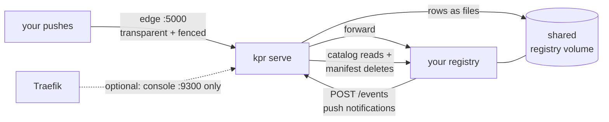

# Adopting kpr: bolting the keeper onto an existing registry

> Not to be confused with `kpr store adopt` — the lineage-pairing
> ceremony ([SENTINELS.md](SENTINELS.md): whose registry is this).
> This guide attaches kpr to your registry; that command pairs a
> store to a lineage.

You already run `distribution`, maybe behind Traefik, and you want
ephemeral tags without migrating to Harbor. kpr goes in front of
it: no registry fork, no data migration, no database.

Start disarmed — it only plans until you say otherwise.

No registry yet? Start at [QUICKSTART.md](QUICKSTART.md) instead.

## Contents

- [What gets wired](#what-gets-wired)
- [Step 0 — pin the image](#step-0--pin-the-image)
- [Step 1 — registry config](#step-1--registry-config)
- [Step 2 — the kpr service](#step-2--the-kpr-service)
- [Step 3 — Traefik, if you use it](#step-3--traefik-if-you-use-it)
- [Step 4 — first run, still disarmed](#step-4--first-run-still-disarmed)
- [Step 5 — arming it](#step-5--arming-it)
- [Troubleshooting](#troubleshooting)
- [Using redis instead of files](#using-redis-instead-of-files)

## What gets wired



Two wires and a volume:

1. **Registry → kpr.** Push notifications to the receiver at
   `POST http://kpr:8080/events`. The registry container reaches kpr
   by service name on a shared Docker network.
2. **kpr → registry.** Catalog reads for `reap`, and manifest
   deletes by digest for the sweeper. Needs
   `storage.delete.enabled: true`.
3. **The registry's storage volume, mounted into kpr.** Not
   optional. kpr proves it is looking at the registry's own store
   before it ever deletes, and that proof reads and writes real
   bytes. Rows live on that same volume by default, so the registry
   root carries images and kpr's memory of them as one unit.

**What stays off Traefik.** Notifications from inside the registry
container to a public URL would hairpin through TLS and any auth
middleware — don't. Pushes stay off it too: they land on kpr's edge
(`:5000`, moved off the registry), a transparent proxy that fences
mutating routes. Traefik only ever fronts the console.

## Step 0 — pin the image

Multiplatform images publish on tags only, since per-push builds
are heat: `nrtn.dev/catalyst/kpr:<release-tag>` (`latest` tracks
semver releases). Pin a tag; don't float.

## Step 1 — registry config

Merge into your `registry-config.yml`. These are all stock
`distribution` keys — there is nothing kpr-specific to install
server-side:

```yaml
notifications:
  endpoints:
    - name: kpr
      url: http://kpr:8080/events   # service name on the shared network
      timeout: 1s
      threshold: 5
      backoff: 1s

storage:
  delete:
    enabled: true   # without this every sweeper DELETE 405s

http:
  relativeurls: true   # the edge fronts this registry, so upstream
                       # URLs must never name the backend
```

Three things to get right:

- **`url` resolves from the registry container.** `http://kpr:8080`
  means "a container named `kpr` on our shared network" — not
  Traefik, and not `localhost`, which is the registry container
  itself.
- **Never set `http.host` alongside `relativeurls`.** It silently
  overrides the knob, and that fails the edge proof. No proof, no
  edge.
- **Restart the registry.** It reads the config file once, at boot.

Your existing `storage.cache.blobdescriptor` config is untouched —
kpr never reads blob metadata. It does matter at gc time, though;
see [GC.md](GC.md#after-an-armed-run-stale-blob-descriptors).

## Step 2 — the kpr service

Same network as the registry. `CMD` already runs `kpr serve`, and
one-shot commands stay disarmed until `KPR_CLI_NO_DRY_RUN=true`.

```yaml
services:
  kpr:
    image: nrtn.dev/catalyst/kpr:<release-tag>   # pin it, see Step 0
    container_name: kpr
    volumes:
      # Both are required. kpr resolves the store root from the
      # registry's own config, then proves that mount is the store
      # the registry serves.
      - registry-data:/var/lib/registry
      - ./registry-config.yml:/etc/distribution/config.yml:ro
    ports:
      # The published registry port moves here: pushes land on the
      # edge, which is default-on inside `serve`.
      - "5000:5000"
    environment:
      - KPR_EDGE_ADDR=:5000
      - KPR_REGISTRY_URL=http://registry:5000
      # Rows beside the images, so the registry root is a complete,
      # self-contained backup. Must be absolute.
      - KPR_STORE_DIR=/var/lib/registry/kpr
      # Arm only after the first dry run (Step 4). Anything but
      # exactly "true" keeps implicit dry-run: plans, never deletes.
      # - KPR_CLI_NO_DRY_RUN=true
    networks:
      - registry-net
    restart: unless-stopped
```

Make sure the registry service drops its own `ports:` entry for
5000 — that port belongs to the edge now — and that both containers
run as the **same uid**, since they share the blob store. `user:
"1000:1000"` on both is the simple answer.

`KPR_APP_PORT` (receiver, default `8080`) and
`KPR_MANAGEMENT_PORT` (console, default `9300`) only matter if
those ports collide on your network. Full wiring reference:
[CONFIG.md](CONFIG.md).

## Step 3 — Traefik, if you use it

One router, console port 9300 only:

```yaml
    labels:
      - traefik.enable=true
      - traefik.http.routers.kpr.rule=Host(`kpr.example.com`)
      - traefik.http.routers.kpr.entrypoints=websecure
      - traefik.http.routers.kpr.tls.certresolver=letsencrypt
      - traefik.http.services.kpr.loadbalancer.server.port=9300
```

- kpr must join the network Traefik watches, or the router has no
  backend.
- Put your usual auth middleware on that router if the console
  shouldn't be public. The receiver is a different port and is
  unaffected.
- Notifications bypass Traefik entirely, by Step 1's internal URL.

## Step 4 — first run, still disarmed

Order matters. `unlock` mints the baseline and pairs the store;
`adopt` only ever *re*-pairs, so on a fresh registry it correctly
refuses — nothing is served yet, so there is nothing to pair to.
Don't start there.

```bash
docker compose up -d kpr
docker exec kpr kpr store unlock    # proves the shared store, pairs it
```

Then push something ephemeral and watch it get tracked:

```bash
crane copy busybox:latest registry.example.com/test/hello:10m

docker exec kpr kpr status    # tracked: 1, due: 0
docker exec kpr kpr plan      # nothing before minute 10
# ...after 10 minutes...
docker exec kpr kpr reap --no-dry-run   # marks ttl:10m elapsed
docker exec kpr kpr sweep               # dry-run: plans, deletes nothing
```

Nothing has been deleted: the plan shows only what *would* go.

## Step 5 — arming it

When the plan looks right, set `KPR_CLI_NO_DRY_RUN=true`, recreate
kpr, and repeat. This time `sweep` deletes by digest.

Manifest deletes drop the reference only. To reclaim blob bytes,
use `kpr gc` — it previews by default and proves the store is
yours before collecting:

```bash
docker exec kpr kpr gc                  # preview, deletes nothing
docker exec kpr kpr gc --no-dry-run     # collect
```

Full ceremony, including when the registry has to go readonly and
what to do about a stale blob-descriptor cache afterwards:
[GC.md](GC.md).

## Troubleshooting

| Symptom | Cause |
| --- | --- |
| 405 on delete | `storage.delete.enabled` didn't apply — did the registry reload the patched config? |
| No rows after a push | the registry → kpr path: `url` typo, wrong network, or kpr down. The registry logs the failed POSTs. |
| `unlock` fails `permission denied` | uid mismatch on the shared volume (below) |
| `no filesystem storage root` | the registry config isn't mounted into kpr, or uses a non-filesystem driver |
| Sweeping paused after a restart | the 5-minute sweep lock, if the old instance died mid-pass. Self-heals at expiry. |

**Fresh volumes are root-owned, and both writers run as uid 1000.**
After a first-ever `up` (or a `down -v`), the first write fails:
the registry 500s on push, and `unlock` hits `permission denied` on
the sentinel. `make up` / `just up` claims the store for you;
hand-started stacks need one:

```bash
docker exec -u 0 kpr chown -R 1000:1000 /var/lib/registry
```

**A clock-source warning is harmless.** The default `local` method
checks nothing. With `https` or `ntp` selected, a host that can't
reach the source warns and proceeds on local time. Actual skew — a
wrong clock, not an unreachable source — still refuses: fix the
clock, then retry. See [TIMESTAMPS.md](TIMESTAMPS.md).

**Old images are kept.** Rows are anchored at receiver push time,
so tags that predate kpr have unknown age and default to keep. To
adopt them, run `kpr store backfill`, which reads real push times
off the tag-link mtimes — see [BACKFILL.md](BACKFILL.md).

**macOS dev only:** AirPlay Receiver squats `localhost:5000`.
Production Linux hosts don't have it, and serve warns at boot when
it sees `Server: AirTunes` anyway.

## Using redis instead of files

Files are the default and need nothing. Reach for redis when one
host and one directory stop being enough — multiple kpr processes,
or state you want off the registry volume.

Drop `KPR_STORE_DIR` and set instead:

```yaml
      - KPR_REDIS_ADDR=redis:6379
      - KPR_REDIS_PASSWORD=${REDIS_PASSWORD:?set a redis password}
      - KPR_REDIS_DB=4
```

kpr needs a logical DB nobody else uses. This repo's convention is
**DB 4**: 0–2 belong to other tenants, and 3 is the registry
blob-descriptor cache in a realistic setup. Confirm it's free:

```bash
redis-cli -a "$REDIS_PASSWORD" INFO keyspace
```

The volume mounts in Step 2 stay exactly as they are — redis holds
rows, not proof. Backend details and trade-offs:
[STORES.md](STORES.md).
