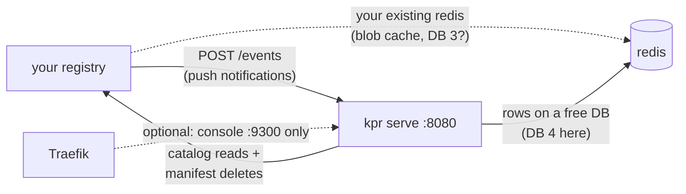

# Adopting kpr: bolting the keeper onto an existing registry (+ Traefik)

You already run `distribution` (maybe behind Traefik, maybe with redis
blob-descriptor cache) and you want ephemeral tags without migrating
to Harbor. kpr attaches as a sidecar: no registry fork, no data
migration, three wires. Start disarmed — it only plans until you say
otherwise.

## The three wires



1. **Registry → kpr**: push notifications to the receiver
   (`POST http://kpr:8080/events`). The registry container must reach
   kpr by service name — same Docker network, internal URL.
2. **kpr → registry**: catalog reads (`reap`) and manifest deletes by
   digest (sweeper). Needs `storage.delete.enabled: true`.
3. **Both → state**: kpr rows live on one logical DB of your (or a
   new) redis. Never the registry's blob-cache DB — pick a free one.
   (No redis at all? `KPR_STORE=file` keeps rows as plain files on a
   shared volume instead — see [docs/STORES.md](STORES.md). The rest
   of this guide assumes redis.)

Traefik only ever fronts the **console** (`:9300`). The receiver stays
off Traefik: notifications from inside the registry container to a
public URL hairpin through TLS and any auth middleware — don't.

## Step 0 — pin the image

Multiplatform images publish on tags only (per-push builds are
heat): `nrtn.dev/catalyst/kpr:<release-tag>` (`latest` tracks semver
releases). Pin a tag; don't float.

## Step 1 — redis: one free DB

Reuse your existing redis. kpr needs a logical DB nobody else uses —
this repo's convention is **DB 4** (0–2 belong to other tenants, 3 is
the registry blob-descriptor cache in a realistic setup), plus the
password if auth is on:

```bash
redis-cli -a "$REDIS_PASSWORD" INFO keyspace  # confirm DB 4 empty
```

Or copy the `redis` service from this repo's `docker-compose.redis.yml`
(password + persistence + healthcheck included).

## Step 2 — registry config: notify + allow deletes

Merge into your `registry-config.yml` (keys are stock
`distribution` — nothing kpr-specific to install server-side):

```yaml
notifications:
  endpoints:
    - name: kpr
      url: http://kpr:8080/events   # service name on the shared network
      timeout: 1s
      threshold: 5
      backoff: 1s

storage:
  delete:
    enabled: true   # without this every sweeper DELETE 405s
```

Notes:

- `url` resolves **from the registry container**. `http://kpr:8080`
  means "a container named `kpr` on our shared network" — not
  Traefik, not `localhost` (that's the registry container itself).
- Your existing `storage.cache.blobdescriptor.redis` (DB 3 or
  wherever) is untouched; kpr never reads blob metadata.
- Restart the registry after the config change — it reads the file
  once at boot.

## Step 3 — the kpr service

Same network as the registry (and Traefik, if you want the console
routed). `CMD` already runs `kpr serve`; disarmed until
`KPR_NO_DRY_RUN=true`:

```yaml
services:
  kpr:
    image: nrtn.dev/catalyst/kpr:<release-tag>   # pin it, see Step 0
    container_name: kpr
    environment:
      # Registry peer: internal service URL, as the kpr container sees it.
      - KPR_REGISTRY_URL=http://registry:5000
      - KPR_REDIS_ADDR=redis:6379
      - KPR_REDIS_PASSWORD=${REDIS_PASSWORD:?set a redis password}
      - KPR_REDIS_DB=4
      # Arm only after the first dry run (Step 5). Anything but exactly
      # "true" keeps implicit dry-run: plans, never deletes.
      # - KPR_NO_DRY_RUN=true
    networks:
      - registry-net        # shared with registry (+ traefik below)
    restart: unless-stopped
    # Optional: console via Traefik. The receiver (:8080) stays
    # internal — no route for it.
    labels:
      - traefik.enable=true
      - traefik.http.routers.kpr.rule=Host(`kpr.example.com`)
      - traefik.http.routers.kpr.entrypoints=websecure
      - traefik.http.routers.kpr.tls.certresolver=letsencrypt
      - traefik.http.services.kpr.loadbalancer.server.port=9300
```

`KPR_APP_PORT` (receiver, default `8080`) and
`KPR_MANAGEMENT_PORT` (console, default `9300`) only matter if those
ports collide on your network. Full wiring reference:
[CONFIG.md](CONFIG.md).

## Step 4 — Traefik checklist

- kpr joins the network Traefik watches (your `registry-net` or
  Traefik's own) — otherwise the router has no backend.
- One router, console port 9300 only. Put your usual auth middleware
  on it if the console shouldn't be public — the receiver is a
  different port and unaffected.
- Notifications bypass Traefik entirely (Step 2's internal URL). If
  rows never appear, the registry log saying `notification error`
  means it can't reach `http://kpr:8080` — network first, config
  second.

## Step 5 — first run, still disarmed

```bash
docker compose up -d kpr
crane copy busybox:latest registry.example.com/test/hello:10m

docker exec kpr kpr status    # tracked: 1, due: 0
docker exec kpr kpr plan      # nothing before minute 10
# ...after 10 minutes...
docker exec kpr kpr reap --no-dry-run   # marks ttl:10m elapsed
docker exec kpr kpr sweep               # dry-run: plans, deletes nothing
```

When the plan looks right, set `KPR_NO_DRY_RUN=true`, recreate kpr,
and repeat — this time `sweep` deletes by digest. Then reclaim blob
bytes with the registry's offline GC (`registry garbage-collect
--delete-untagged <config>`): deletes drop the manifest reference
only; GC needs the registry stopped, so schedule the downtime.

## What to expect (and what not to)

- **Old images are kept.** Rows are anchored at receiver push time;
  tags pushed before kpr arrived have unknown age and default to keep.
  Backfill is a known gap (see PLAN status) — kpr guards the future,
  it doesn't audit the past.
- **405 on delete** → `storage.delete.enabled` didn't apply: check the
  running registry really loaded the patched config (restart it).
- **No rows after push** → registry → kpr path: `url` typo, wrong
  network, or kpr down. The registry logs the failed POSTs.
- **Recreating kpr pauses sweeping** up to the 5-minute sweep lock —
  self-heals at expiry, plan with `kpr status` meanwhile.
- **macOS dev only**: AirPlay Receiver squats `localhost:5000`.
  Production Linux hosts don't have it; `make up` and serve boot warn
  when they see `Server: AirTunes` anyway.
