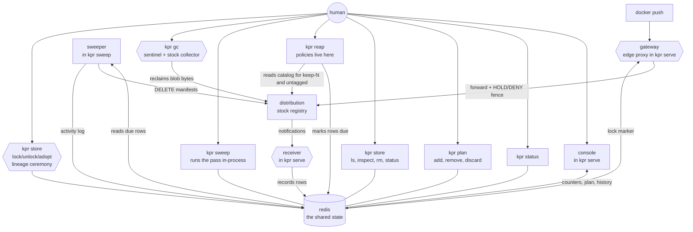
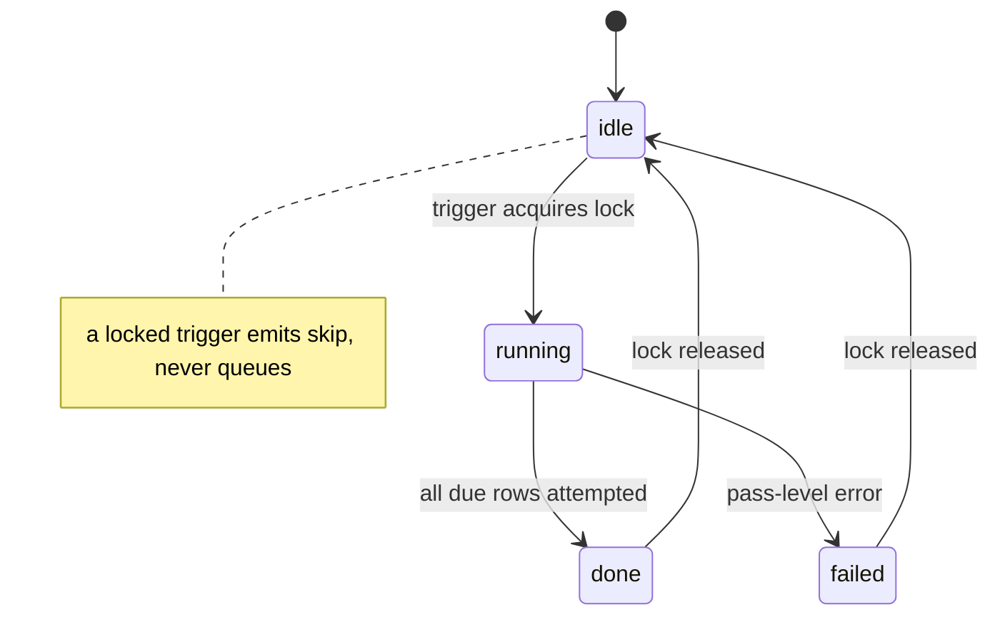

# kpr architecture

Dead-simple gateway and keeper that stops a local `distribution`
registry from becoming a pig. One binary, one state backend (plain
files by default, redis with `KPR_REDIS_ADDR`), opinionated,
use-case driven policies written as plain code. The diagrams below
name redis because that is the multi-process shape; swap in the
file store and the components are unchanged. Both backends:
[STORES](STORES.md).

## Contents

- [Components](#components)
- [Layering](#layering)
- [Reaping policies](#reaping-policies)
- [The plan](#the-plan)
- [Garbage collection](#garbage-collection)
- [Data](#data)
- [Surfaces](#surfaces)
- [Failure modes](#failure-modes)
- [Sweeper events](#sweeper-events)
- [Feedback, not log streaming](#feedback-not-log-streaming)
- [Deliberately out](#deliberately-out)
- [Background: why not a registry](#background-why-not-a-registry)

Open and upcoming work: [ARCHITECTURE_FUTURE.md](ARCHITECTURE_FUTURE.md).

## Components

Hexagons are the recording paths: the receiver signs
`kpr-receiver`, `gc` signs `kpr-gc` (mints) and `kpr-heal`
(adopt-recorded generations land via gc runs), the ceremony signs
`kpr-unlock`, the gateway signs `kpr-edge` (fence flips land in
the ring), backfill signs `kpr-backfill` (absent rows stamped
not-due, never mints). Full vocabulary in Data below.

The gateway is a future actor living in `serve` today, not a
separate command: the edge proxy forwards pushes to the registry
byte-identical and fences mutating routes — HOLD leases around
the armed collect, DENY on the lock marker — through the same
evaluation the use cases mint from (boolean, not a mint). It
opens only on a RelativeURLs proof over the registry config (no
proof, no edge); `KPR_EDGE=false` opts out. Either way serve
keeps serving, and the console carries its live posture
(open/closed, deny/held) in its own section. Full story in
`docs/GATEWAY.md`.

Deletes have one owner: the sweeper is the only deleter of
registry manifests and tracked rows — `store rm` calls into it
(`Sweeper.Untrack` for rows, `Sweeper.Untag` for manifests, a
specific sweep going around the plan) instead of deleting past it.
The CLI splits along the decision line:
`reap` marks, `sweep` runs, `plan` edits, `gc` reclaims. `reap`
evaluates the policies (reading candidates from redis, and the catalog
from the registry for keep-N and untagged) and marks rows due with a
reason — analysis-heavy, fast, no registry writes. `sweep` runs the
pass in-process (`Sweeper.RunPass` drives the due rows, then prints
the summary) — no opinions, just running and reporting. `serve`
serves endpoints (events, console); it never sweeps. Nothing runs
on its own: kpr is not a scheduler, so a marked row waits until
someone runs `sweep`. `status`/`plan` stay pure redis reads.

## Layering

Hexagonal, taken to heart: behaviors live in use cases behind
ports, adapters only translate. The full story is in
`docs/HEXAGONAL.md` (the current port map) and
`docs/HEXAGONAL_WISDOMS.md` (the port-cutting rules learned along
the way).

- **Core**: `policy` — pure over `(rows, catalogs, now)`. No ports
  needed; time arrives as an argument.
- **Use cases**: `keeper` (evaluate, reap, status, plan),
  `gc` (`Run` behind `Probe`/`Collector`/`Locker`), `sweep`
  (pass loop behind `Registry`). Pure orchestration, substitutable
  in tests with no HTTP server, binary, or redis.
- **Outbound adapters**: `store` (redis + mem + file behind one pinned
  contract), `registry`, `clock` (local/https/ntp time sources), `otel`.
- **Driving adapters**: `cli`, `web` — parse, call, render.
  `cli.openDeps` is the composition root.
- **Inbound bypass, by design**: the redis due-mark is a public
  surface — anything that can write the mark decides how and when
  to clean what. The sweeper TTL floor (never wipe before the
  promise elapses) guards it.

## Reaping policies

All five policies are live behind `reap [policy]` (bare `reap` means
`reap all`); one evaluation path (`EvaluatePolicy`/`EvaluatePolicies`)
serves the CLI and the e2e suite alike. Marks accumulate across calls
until `sweep` or `plan discard`. `latest` is spared by every policy
and never counts into keep-N.

| Policy | Reason (marks a row eligible) | Tuning (in code) |
| --- | --- | --- |
| `ttl` | `ttl:<d> elapsed` — explicit TTL (bare `10m`, suffixed `myapp-10m`) elapsed since push | `MaxTTL` |
| `hash` | `ttl:<d> elapsed` — bare hash past the default (next-day triage) | `HashTTL` |
| `partial` | `partial:older than <age>` — digest-less row older than the max age (a push that never completed) | `StaleUploadMaxAge` |
| `untagged` | `untagged:past grace <grace>` — tracked tag gone from the live catalog past the grace period | `UntaggedGrace` |
| `keep-n` | `keep-n:exceeds <n>` — everything past the freshest N tags per repo | `KeepN` |

Tunings are consts in code (`internal/policy`, `internal/policy/select.go`),
not config — the table names them, never their values.

TTL shapes: `ttl` takes anything with an explicit duration, `hash`
takes bare hashes with none. The suffix is the intent, so the stem
carries no meaning; bare tags stay hex-scoped.

| Shape | Reason | Tuning | Policy |
| --- | --- | --- | --- |
| CI commit builds `abc1234-10m`: any stem + `-ttl` suffix (explicit intent) | `ttl:10s elapsed` | `MaxTTL` | `ttl` |
| Bare durations `10m`: number + unit, no stem | `ttl:10m0s elapsed` | `MaxTTL` | `ttl` |
| Bare hashes `abc1234`: hex 6+ with a letter, no suffix (next-day triage) | `ttl:48h0m0s elapsed` | `HashTTL` | `hash` |

keep-N is intentionally fixed: N is a const (10), include is unset,
excludes arrive via the reap flag. Per-repo tuning stays out by
decision (see Deliberately out).

Dry-run is implicit: `reap` prints unless `--no-dry-run`, the sweeper
plans unless armed, `gc` previews unless `--no-dry-run`. Direct plan
edits (`plan add`, `plan remove`, `plan discard`) have no dry-run —
they are the operator's explicit hand, like discard always was.

## The plan

Due marks plus reasons, in redis. `plan` shows them (optionally
`--json`); three subcommands edit them:

- `plan add <pattern>...` — Kyverno-style globs (`*` crosses slashes,
  `?` one char) or `regex:` for full regex, unioned, marked `manual`.
  An exact `repo:tag` spelling is typo-proof: matching no tracked row
  refuses before anything marks (no phantom rows).
- `plan remove <pattern>...` — glob, `regex:`, or exact image through
  one matcher; drops due marks, rows survive.
- `plan discard` — drops every due mark, reports the count.

## Garbage collection

Manifest deletes drop references only; the bytes need a collector.
`kpr gc` is a thin wrapper around the registry's own: it shells the
stock `registry garbage-collect` (COPYd from the same `registry:3`
the stack runs, unmodified) and adds a gate chain around the call.

Nine gates run before it, in order — intent, mounts, store root,
clock, gc lock, mode, a mode-specific cache-or-fence check,
lineage, and a minted generation — then the collect, then two
confirmations: prune the empty directories the collector leaves,
and re-probe the mode. Each gate produces a sealed token the next
stage takes as an argument, so a path that skipped one cannot be
written. Every gate and every `--accept-*` override:
[GC.md](GC.md).

Three properties worth stating here, because they shape the design
rather than the procedure:

- **The mode decides the path, not a flag.** A cancelled
  blob-upload initiate classifies the registry (202 writable, 405
  maintenance readonly, anything else refuses). Readonly takes the
  classic offline collect and requires the blobdescriptor cache to
  answer; writable collects online, under the gateway HOLD lease,
  and requires no cache at all. There is no `--online` to forget.
- **The lock is advisory by necessity.** The shared `kpr:gc:lock`
  (30m bound) serializes kpr-driven runs, but distribution's
  `MarkAndSweep` (audited at v3.1.2) takes no lock of its own, so
  a manual `garbage-collect` races the mark phase. Never run one
  alongside.
- **The collector is a subprocess, not a library.** It streams
  through an evented runner (pipe capture, line streaming, fd
  drain discipline, cancel kills, failures carrying the last
  line). Flipping the registry readonly stays with the operator;
  the command never rewrites registry config.

## Data

Redis holds state, never log streams. Rows carry no redis key TTL:
the sweeper must see an expired row to delete it, and removes the row
only after the registry confirms.

| Key | Shape |
| --- | --- |
| `kpr:rows` | HASH of `repo\x00tag` → row JSON (repo/tag/digest/media, push time, actor, due mark + reason) |
| `kpr:sweep:current` | one JSON pass record, overwritten through a pass |
| `kpr:sweep:activity` | capped outcome ring (100, newest first) |
| `kpr:sweep:lock` | sweeper single-flight lock (5m bound) |
| `kpr:gc:lock` | collector single-flight lock (30m bound) |
| `kpr:store:unlocked` | intent marker (`unlock` sets after proof, `lock` drops; file backend: `<dir>/unlocked`) |
| `kpr:identity` | lineage pairing as JSON (file backend: `<dir>/identity.json`; absent = unpaired) |

Row actors name the recording component, never the pusher (the
notification's `actor.name` — basic-auth username or nothing —
carries no retention meaning): `kpr-receiver` signs notification
rows, `kpr-unlock` / `kpr-gc` sign their generation mints,
`kpr-heal` signs an adopted untracked generation whose payload
predates writers, `kpr-backfill` signs backfill rows. The
vocabulary is closed at five: every recording path runs through a
hexagon above. (Old rows may still carry `""` or a pusher name —
re-push restamps them.)

Activity records carry two more names with a split meaning: actor
is who carried the operation out (always `kpr-sweep` — one pair of
hands), trigger is what caused it (the pass trigger `sweep`, or
`untag` for directed deletes). The field names may
earn better ones later; the split stays.

## Surfaces

Console (server-rendered, no SPA) shows only what kpr tracks — never
a registry catalog: banner (registry/redis reachability),
counters, plan with reasons, activity ring. It advertises no sweep
posture: the console never sweeps, arming is per-invocation. The
front page is the keeper face: hero line, glowing health ball
polling the console, footer status.

CLI, next to `serve` and `env`:

- `kpr status` — banner + counters as text, for scripts and ssh.
- `kpr plan` — pending candidates, optionally JSON for piping, plus
  `add` / `remove` / `discard`.
- `kpr store` — the rows themselves: `ls` (short columns, `--long`,
  `--json`; sentinels take `ls sentinels`),
  `inspect <repo:tag>` (one full row), `rm` (drop rows; tag stays,
  untracked — exact spellings, all-or-nothing, no dry-run;
  `--untag` deletes the manifest by digest first, row drops on
  confirm);
  `lock` / `unlock` set / drop the intent marker (proof first);
  `adopt [IDENT] [--gen]` — the only pairing writer: pairs the
  store to the served lineage. Full ceremony in `docs/SENTINELS.md`.
  `status` shows the card: backend, lock, proof, identity, and the
  activity tail (`--json` for piping).
- `kpr reap [policy]` — evaluates one policy or all and marks rows
  due. Dry-run unless `--no-dry-run`.
- `kpr sweep` — runs a sweep pass in-process and prints the summary.
  No opinions, no marks: only rows already marked due are processed.
- `kpr gc` — previews by default; `--no-dry-run` collects for real.

Colocation constraint: the CLI talks to redis directly, so it runs in
the same environment as `serve` (same network, same redis auth). An
API head for detached operation is explicitly deferred.

Registry auth scope: kpr's registry client speaks anonymous or basic
(one user+password pair, env-supplied) — that covers open and htpasswd
registries, which is all kpr claims today. Token-issuing registries
(JWT bearer) are future work: same pair, exchanged at the issuer per
scope (see [GC_FUTURE.md](GC_FUTURE.md#token-auth-registries)).
The `auth` in
Deliberately-out below is unrelated — kpr will never be an
auth provider, only a client of the registry's.

## Failure modes

- **Redis down**: receiver can't record (logs, banner goes red;
  pushes in the gap stay untracked — accepted and visible, not
  silent). CLI fails fast with a clear error. Nothing
  half-happens: every mutation is row-gated.
- **Registry 500s on delete**: the row stays, the attempt is logged
  to activity, retry happens on the next asked pass. `sweep`'s
  printed summary surfaces the failure instead of swallowing it.
- **Store unreachable mid-pass**: `sweep` prints the pass with
  `failed:` lines naming the outage instead of failing or reading
  empty. The rows wait — nothing runs unasked.
- **gc unproven anything**: missing mounts, non-filesystem store,
  inconclusive sentinel, unproven shared store, foreign lineage,
  skewed clock, dead cache, held lock — every one refuses with the
  remedy, never collects blind.

## Sweeper events

A sweep pass is a long, multi-stage operation — modeled on a fixed
stage vocabulary with one event struct, emitted in-process and (later)
on the wire. Silence stays cheap: events are small JSON, written to
redis run-state, never fail the pass.

| Stage | Meaning |
| --- | --- |
| `start` | pass entered (trigger: `sweep` or `untag`) |
| `skip` | nothing due, or another pass holds the lock |
| `row` | one due row attempted (repo, tag, reason, outcome) |
| `done` | rows exhausted (performed / planned / failed counts) |
| `failure` | pass-level error, e.g. redis lost mid-pass, lineage refused (foreign/silent/rolled-back registry — skipped with the cause in `failures`, before the lock) |

Run state lives in redis under two keys: `current` (one JSON record,
overwritten through the pass: pass id, stage, started_at, trigger,
due/done counts) and the capped outcome `activity` ring. That is what
lets a CLI report "what the sweeper is doing right now" without
anyone streaming logs.

Transport for live stages is undecided (redis polling of `current`
vs. a websocket on the console) — deliberately deferred. The
vocabulary and the keys are the contract; the wire comes later.

Anti-scheduler guardrails, so the event flow doesn't grow a task
manager:

- Single-flight via a redis lock with expiry (a crashed sweeper
  can't hold it forever). A trigger that finds the lock emits `skip`.
- Triggers are exactly the asked ones: `kpr sweep`, `untag`. No
  queue, no backlog, no cron inside the server — kpr is not a
  scheduler, and a second trigger never stacks work, it skips.
- Events describe one pass at a time. There is no job record, no
  history beyond the capped ring, nothing to retry except asking
  again for rows that are still due.

The gc runner reports on the same JSON-lines event shape (lifecycle
stages with elapsed times), should the console ever subscribe.

## Feedback, not log streaming

Two feedback paths, both bounded:

- **Pass summary**: `Sweeper.RunPass` returns the outcome of the
  pass it ran (performed / planned / failed counts plus failures)
  and `sweep` prints it. That is `sweep`'s feedback — synchronous,
  no redis polling, no HTTP round-trip.
- **Activity**: a capped ring in redis (last ~100 small outcome
  records: repo, tag, reason, outcome, timestamp) backing the
  console's Activity section. A ring of outcomes is state — it
  answers "what happened" at a glance. Verbose operational logs stay
  where they are (stdout / OTLP), never in redis, never pushed to
  clients.

## Deliberately out

Policy/workflow engine, task manager, scheduler, config-file or
DB-backed rules, per-repo rule sets, auth, signing, replication,
cloud integrations. keep-last-N tuning beyond the exclude flag stays
a const — as a plain function with colocated tunings, not a rule
language. If a behavior starts wanting its own engine, it moves out
to the admin CLI instead of growing inside kpr. Online GC is out
of scope: it would need our own registry engine, not a gateway —
offline `kpr gc` is the reclaim mechanism, and soft-deleted blobs
dedupe re-pushes until it runs.

## Background: why not a registry

Two prior-art projects fixed kpr's position (surveyed September
2026: upstream `replicatedhq/ttl.sh` main, `project-zot` docs).
ttl.sh's companion started as plain `distribution` + notification
hooks + redis bookkeeping, then moved to zot with a real Go sidecar
(`sidecar/zot-ephemeral-ttl`): event → redis row → sweep →
confirmed delete, rows carrying no redis key TTL (the reaper must
see an expired row; the row drops only after the registry
confirms) — the mechanism kpr absorbs, minus the hosted-service
load (deploys, CloudEvents modes, cosign edge cases, retention
interplay). zot itself is a registry replacement with retention
policies in config — adopting it trades missing features for a
policy-engine surface, exactly the bloat kpr avoids — but even
zot has no tag-encoded TTL: per-tag expiry-by-name needs something
beside the registry on either backend.

kpr's position: front a dumb registry, never become one. Speak the
plain distribution API (keeps zot working as a backend for free),
keep all policy in testable Go with colocated tunings, absorb
ttl.sh's bookkeeping semantics minus the hosted-service load.

kpr started as a pure out-of-band companion and has since grown
into the push path: the edge proxy in `serve` forwards pushes
byte-identical and fences mutating routes, which is what makes
online gc and the lock ceremony enforceable rather than advisory.
That shift is recorded in [GATEWAY.md](GATEWAY.md). The line it
does not cross is storage: the registry still owns the bytes.
