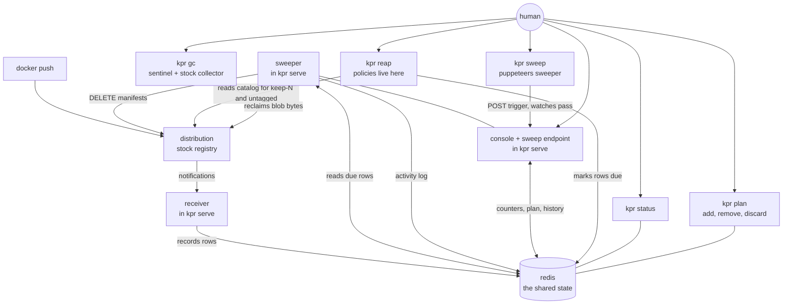
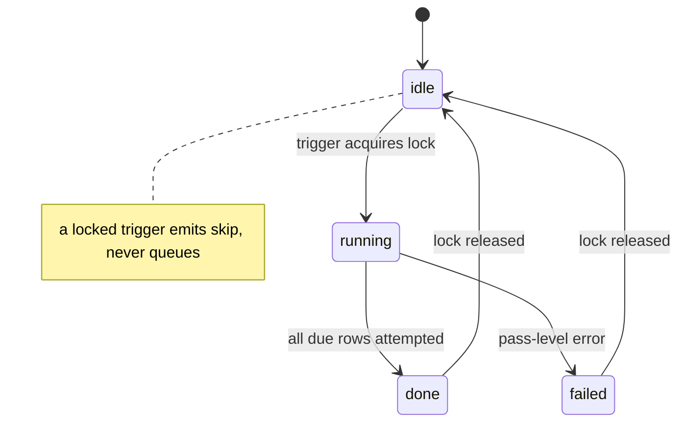

# kpr architecture

Dead-simple companion that keeps a local `distribution` registry from
becoming a pig. One binary, one state backend (redis by default, plain
files with `KPR_STORE=file`), opinionated behaviors written as
plain code — no policy engine. This page draws the redis deployment;
the file alternative is in [docs/STORES.md](STORES.md).

Placement rule: the behaviors are client-side — they live in the
`reap` command (or any script), not in `serve`. `serve` is a dumb
executor: the receiver records rows, the sweeper deletes due rows.
Marking a row due with a sweep reason **is** the interface: `reap`
holds the programmatic policies, but anything that can write the mark
(a shell script, a cron job, a human with redis-cli, `plan add`)
decides how and when to clean what. Tunings live next to the policy
code (package-level consts at the top of the policy file), **not** in
the main config — `internal/config` stays wiring-only (ports, redis
addr, registry URL).

## Components

Sweeping has one owner: the sweeper in `serve`, the only writer that
deletes from the registry. The CLI splits along the decision line:
`reap` marks, `sweep` puppeteers, `plan` edits, `gc` reclaims. `reap`
evaluates the policies (reading candidates from redis, and the catalog
from the registry for keep-N and untagged) and marks rows due with a
reason — analysis-heavy, fast, no registry writes. `sweep` POSTs the
sweep endpoint and watches the event dance to the pass summary — no
opinions, just triggering and reporting. Marked rows are picked up on
the next tick even if no one ever runs `sweep`, so the trigger is an
accelerator, not a dependency. `status`/`plan` stay pure redis reads.
No gRPC, no IDL — one small HTTP trigger on the server that already
exists.

## Layering

Hexagonal, taken to heart: behaviors live in use cases behind
ports, adapters only translate. The full story is in
`docs/HEXAGONAL.md` (how it got there, slice by slice) and
`docs/HEXAGONAL_WISDOMS.md` (the port-cutting rules learned along
the way).

- **Core**: `policy` — pure over `(rows, catalogs, now)`. No ports
  needed; time arrives as an argument.
- **Use cases**: `keeper` (evaluate, reap, status, plan),
  `gc` (`Run` behind `Probe`/`Collector`/`Locker`), `sweep`
  (pass loop behind `Registry`). Pure orchestration, substitutable
  in tests with no HTTP server, binary, or redis.
- **Outbound adapters**: `store` (redis + mem behind one pinned
  contract), `registry`, `otel`.
- **Driving adapters**: `cli`, `web` — parse, call, render.
  `cli.openDeps` is the composition root.
- **Inbound bypass, by design**: the redis due-mark is a public
  surface — anything that can write the mark decides how and when
  to clean what. The sweeper TTL floor (never wipe before the
  promise elapses) guards it.

## Behaviors

All four policies are live behind `reap [policy]` (bare `reap` means
`reap all`); one evaluation path (`EvaluatePolicy`/`EvaluatePolicies`)
serves the CLI and the e2e suite alike. Marks accumulate across calls
until `sweep` or `plan discard`. `latest` is spared by every policy
and never counts into keep-N.

| Policy | Selector | Tunings |
| --- | --- | --- |
| `expired` | TTL tag elapsed since push (minimal promise: never wiped before, collectible after) | `MaxTTL` 30d clamp; `HashTTL` 48h default for bare commit hashes; suffix `<hex6+>-<ttl>`; all-digit tags default keep |
| `partial` | digest-less rows older than the max age (pushes that never completed) | `StaleUploadMaxAge` 24h; unknown age defaults keep |
| `untagged` | tracked tag gone from the live catalog past the grace period | `UntaggedGrace` 168h; unfetched repos skip (absent means unknown) |
| `keep-n` | everything past the freshest N tags per repo | `KeepN` 10, fixed; `reap --exclude` regex spares release lines; catalog-only tags default keep |

keep-N is intentionally fixed: N is a const (10), include is unset,
excludes arrive via the reap flag. Tested and running; per-repo
tuning stays out by decision (see Deliberately out).

Dry-run is implicit: `reap` prints unless `--no-dry-run`, the sweeper
plans unless armed, `gc` previews unless `--no-dry-run`. Direct plan
edits (`plan add`, `plan remove`, `plan discard`) have no dry-run —
they are the operator's explicit hand, like discard always was.

## The plan

Due marks plus reasons, in redis. `plan` shows them (optionally
`--json`); three subcommands edit them:

- `plan add <pattern>...` — Kyverno-style globs (`*` crosses slashes,
  `?` one char) or `regex:` for full regex, unioned, marked `manual`.
  An exact `repo:tag` spelling is typo-proof: matching no tracked row
  refuses before anything marks (no phantom rows).
- `plan remove <pattern>...` — glob, `regex:`, or exact image through
  one matcher; drops due marks, rows survive.
- `plan discard` — drops every due mark, reports the count.

## Garbage collection

Manifest deletes drop references only; blob bytes need the stock
collector against the shared store. `kpr gc` shells the stock
`registry garbage-collect` (COPYd from the same `registry:3` the
stack runs) after proving, in order: binary/config mounts exist, the
store root is local filesystem, the blobdescriptor cache answers
(`REGISTRY_REDIS_PASSWORD`, same convention as the registry —
without it the mark phase eats live layers), the sentinel sees a
classifiable mode, and the local mount is the registry's own store.

- **Sentinel**: a cancelled blob-upload initiate under a probe repo —
  202 means writable, 405 means maintenance readonly, anything else
  refuses. Same-store proof is a fresh `noroutine/kpr-sentinel:live` generation
  written to the local mount and read back through the API — both
  modes, no tracked rows, no API writes. A real run on writable
  refuses unless `--force`; a dry-run preview proceeds warned.
- **Lock**: the shared `kpr:gc:lock` (30m bound) serializes kpr-driven
  runs. It is advisory by necessity — distribution's `MarkAndSweep`
  (audited at v3.1.2) sets no lock and mark-then-sweep races a
  concurrent collector, so never run a manual `garbage-collect`
  alongside.
- **Runner**: the collector streams through an evented subprocess
  (pipe capture, line streaming, fd drain discipline, cancel kills,
  failures carry the last line) with pre/post sentinel events. A mode
  flip mid-run is loud but never a panic — it fails the run unless
  `--force`, which presumes the operator knows. Flipping readonly
  stays with the operator; the command never rewrites registry
  config.

## Data

Redis holds state, never log streams. Rows carry no redis key TTL:
the sweeper must see an expired row to delete it, and removes the row
only after the registry confirms.

| Key | Shape |
| --- | --- |
| `kpr:rows` | HASH of `repo\x00tag` → row JSON (repo/tag/digest/media, push time, actor, due mark + reason) |
| `kpr:sweep:current` | one JSON pass record, overwritten through a pass |
| `kpr:sweep:activity` | capped outcome ring (100, newest first) |
| `kpr:sweep:lock` | sweeper single-flight lock (5m bound) |
| `kpr:gc:lock` | collector single-flight lock (30m bound) |

## Surfaces

Console (server-rendered, no SPA) shows only what kpr tracks — never
a registry catalog: banner (registry/redis reachability, armed vs
dry-run), counters, plan with reasons, activity ring. The front page
is the keeper face: hero line, glowing health ball polling the
console, footer status.

CLI, next to `serve` and `env`:

- `kpr status` — banner + counters as text, for scripts and ssh.
- `kpr plan` — pending candidates, optionally JSON for piping, plus
  `add` / `remove` / `discard`.
- `kpr reap [policy]` — evaluates one policy or all and marks rows
  due. Dry-run unless `--no-dry-run`.
- `kpr sweep` — triggers a sweep pass and watches it to the summary.
  No opinions, no marks: only rows already marked due are processed.
- `kpr gc` — previews by default; `--no-dry-run` collects for real.

Colocation constraint: the CLI talks to redis directly, so it runs in
the same environment as `serve` (same network, same redis auth). An
API head for detached operation is explicitly deferred.

Registry auth scope: kpr's registry client speaks anonymous or basic
(one user+password pair, env-supplied) — that covers open and htpasswd
registries, which is all kpr claims today. Token-issuing registries
(JWT bearer) are future work: same pair, exchanged at the issuer per
scope (see `docs/GC.md` and the backfill plan). The `auth` in
Deliberately-out below is unrelated — kpr will never be an
auth provider, only a client of the registry's.

## Failure modes

- **Redis down**: receiver can't record (logs, banner goes red;
  pushes in the gap stay untracked — accepted and visible, not
  silent). Sweeper skips ticks it can't read. CLI fails fast with a
  clear error. Nothing half-happens: every mutation is row-gated.
- **Registry 500s on delete**: the row stays, the attempt is logged
  to activity, retry happens next tick. `sweep`'s watch surfaces the
  failure instead of swallowing it.
- **Sweep endpoint unreachable**: `sweep` reports "N rows due, sweeper
  not reached — next tick picks them up." Degrades to the tick loop,
  which was always the backstop.
- **gc unproven anything**: missing mounts, non-filesystem store,
  inconclusive sentinel, unproven shared store, dead cache, held lock
  — every one refuses with the remedy, never collects blind.

## Sweeper events

A sweep pass is a long, multi-stage operation — modeled on a fixed
stage vocabulary with one event struct, emitted in-process and (later)
on the wire. Silence stays cheap: events are small JSON, written to
redis run-state, never fail the pass.

| Stage | Meaning |
| --- | --- |
| `start` | pass entered (trigger: tick, startup, or POST) |
| `skip` | nothing due, or another pass holds the lock |
| `row` | one due row attempted (repo, tag, reason, outcome) |
| `done` | rows exhausted (performed / planned / failed counts) |
| `failure` | pass-level error, e.g. redis lost mid-pass |

Run state lives in redis under two keys: `current` (one JSON record,
overwritten through the pass: pass id, stage, started_at, trigger,
due/done counts) and the capped outcome `activity` ring. That is what
lets a CLI report "what the sweeper is doing right now" without
anyone streaming logs.

Transport for live stages is undecided (redis polling of `current`
vs. a websocket on the console) — deliberately deferred. The
vocabulary and the keys are the contract; the wire comes later.

Anti-scheduler guardrails, so the event flow doesn't grow a task
manager:

- Single-flight via a redis lock with expiry (a crashed sweeper
  can't hold it forever). A trigger that finds the lock emits `skip`.
- Triggers are exactly three: tick, sweep-on-start, POST. No queue,
  no backlog, no cron inside the server — a second trigger never
  stacks work, it skips.
- Events describe one pass at a time. There is no job record, no
  history beyond the capped ring, nothing to retry except the next
  tick picking up rows that are still due.

The gc runner reports on the same JSON-lines event shape (lifecycle
stages with elapsed times), should the console ever subscribe.

## Feedback, not log streaming

Two feedback paths, both bounded:

- **Pass summary**: the sweep endpoint's HTTP response carries the
  outcome of the triggered pass (performed / planned / failed counts
  plus failures). That is `sweep`'s feedback — synchronous, no redis
  polling.
- **Activity**: a capped ring in redis (last ~100 small outcome
  records: repo, tag, reason, outcome, timestamp) backing the
  console's Activity section. A ring of outcomes is state — it
  answers "what happened" at a glance. Verbose operational logs stay
  where they are (stdout / OTLP), never in redis, never pushed to
  clients.

## Deliberately out

Policy/workflow engine, task manager, scheduler, config-file or
DB-backed rules, per-repo rule sets, auth, signing, replication,
cloud integrations. keep-last-N tuning beyond the exclude flag stays
a const — as a plain function with colocated tunings, not a rule
language. If a behavior starts wanting its own engine, it moves out
to the admin CLI instead of growing inside kpr. Online GC is out
of scope: it would need our own registry engine, not a sidecar —
offline `kpr gc` is the reclaim mechanism, and soft-deleted blobs
dedupe re-pushes until it runs.

## Background: ttl.sh and zot

What the two projects do today, and what kpr takes from each. Sources:
upstream `replicatedhq/ttl.sh` main branch and `project-zot` docs, read September 2026.

### 1. ttl.sh

Then (a year ago): plain `distribution` registry, a couple of notification
hooks, redis for expiry bookkeeping. That version is gone.

Now: the registry was swapped to **zot**, and the companion is a real Go
service, `sidecar/zot-ephemeral-ttl`. Its mechanism, piece by piece:

- **Ingest** — zot's events extension pushes CloudEvents
  (`zotregistry.image.updated`, binary or structured mode) to the sidecar.
  No polling.
- **TTL parsing** (`internal/ttl`) — expiry is encoded in the tag:
  `^\d+(s|m|h|d|w)$`. Non-matching tags get a default TTL, everything is
  clamped to a max, and integer overflow saturates instead of wrapping
  (a wrapped-negative duration would expire immediately — the opposite of
  a huge TTL's intent).
- **Store** (`internal/store`) — redis with exactly two keys: a HASH of
  `(repo, tag, digest, expires_at)` rows and a ZSET expiry index, members
  joined with a NUL separator, written transactionally. Rows carry **no
  redis key TTL**: the reaper must see an expired row to issue the delete,
  and removes the row only after the registry confirms.
- **Reaper** (`internal/reaper`) — sweep loop with a sweep-on-start (a
  restart doesn't wait a full interval). Failed deletes retry next tick.
  Already-gone (`NAME_UNKNOWN`/`MANIFEST_UNKNOWN`) counts as success.
  Manifests held by an index (`405 DENIED`, despite the wording) are
  untracked rather than retried forever — zot's untagged retention
  collects the child.
- **Registry client** (`internal/registry`) — `DELETE /v2/<repo>/manifests/<tag>`
  against the OCI API, bounded contexts, body-matched error codes so a
  genuinely malformed request stays retryable and visible.
- Every package has tests, plus golangci config and a Makefile.
- Timing semantics: expiry anchors at event receipt
  (`expires_at = event_time + TTL`), the reaper ticks every 30s, so a
  `1h` tag lives its hour plus up to half a minute of tick slack. kpr
  departs here: the tag is a minimal promise (never wiped before),
  expiry is a GC signal collected whenever `reap` runs.

Complexity added since the simple version: CloudEvents parsing in two
modes, multi-arch index reference handling, cosign `.sig` tags outliving
their image, interplay with zot's own untagged retention. None of it is
gratuitous — it is the edge-case load of running the trick in production
as a public service. Around the core sits hosted-service scaffolding kpr
doesn't need: Ansible/Hetzner deploys, nginx tuning, a Next.js site,
zot metadb experiments (later removed), GC time windows.

### 2. zot

An OCI-native registry (CNCF Sandbox) with the lifecycle features
`distribution` lacks, built in:

- **Retention policies** in config: per-repo globs, keep N
  most-recently-pushed/pulled, pushed/pulled-within windows, regex
  patterns, `deleteUntagged` with activity-based `keepUntagged`,
  `deleteReferrers`, `dryRun`, grace `delay`. Defaults already delete
  untagged manifests; tags are retained unless a policy says otherwise.
- **Online GC** in a daily UTC window, Prometheus metrics, scrub,
  search/UI, sync — extensions in the same binary (with a `zot-minimal`
  build that strips them).
- Proper OCI semantics: artifacts, referrers, cosign flows.

Sharp edges: defining one `keepTags` rule removes everything not
matching (their docs insist on a catch-all default policy); untagged
deletion is default-on; retention evaluation has subtle behaviors around
digest statistics. And the structural gap: retention is
activity/count/window-based — there is **no tag-encoded TTL**. Even on
zot, per-tag expiry-by-name needs the sidecar.

### 3. Fit assessment

Neither is a fit for "dead simple but maintainable local registry that
doesn't become a pig":

- ttl.sh is a **hosted service codebase**. The absorbable part is the
  sidecar's mechanism (event → redis row → sweep → confirmed delete),
  not the Ansible/nginx/Next.js shell around it.
- zot is a **registry replacement with a policy engine**. Adopting it
  trades distribution's missing features for a config surface of
  retention policies, extensions, and GC windows — exactly the bloat
  the project wants to avoid. Its CloudEvents/metrics/scrub shape is
  useful reference, not a dependency to take.

kpr's position: stay a dumb-registry companion. Speak the plain
distribution API (keeps zot working as a backend for free), keep all
policy in testable Go with colocated tunings, absorb ttl.sh's sidecar
semantics minus the hosted-service load.

## Current state

Built on `master`, CI green, full unit suite + lint clean, e2e green
in compose. Proven live: push → receiver tracks → `reap --no-dry-run`
marks (one policy via `reap <name>`, hand-picked via `plan add`,
pruned via `plan remove`) → `sweep` deletes by digest → `kpr gc`
previews by default, `--no-dry-run` collects (48M → 1.1M on the test
repo).

- All four policies live and selectable; `latest` spared everywhere
  (10+latest); ensure-survivor tripwires per tag style plus the
  `isBareHash` a/f boundary pins.
- keep-N caveat stands: N fixed at 10, excludes via `reap --exclude`.
- Mutation testing (gremlins, local): scoped efficacy 90.30%,
  mutator coverage 88.74%; survivors are timing mutants, equivalents,
  and live-redis branches that only die under `-tags e2e`.
- GC lock verified advisory against the distribution source
  (`MarkAndSweep` at v3.1.2 sets none).

## Open, in no order

- keep-N tuning surface (`--last`, `--include`): declined, N stays 10 with `--exclude`.
- Backfill for pre-kpr tags; unknown-age rows default keep today.
- Real partial-upload detection (bounded manifest reads).
- Detached `reap`/`sweep` over the console HTTP surface.
- Sweep live-stages transport (polling vs websocket) — still
  deferred; the vocabulary and keys are the contract.
- Registry metrics as a GC-readiness signal (storage pressure before
  collecting) — noted, not scheduled.
- Tag-release flow (image push + Forgejo release) unverified.
