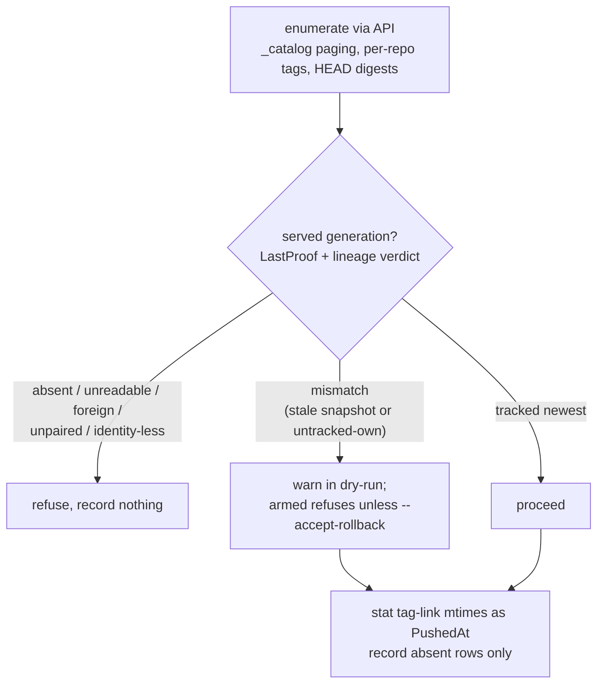

# Backfill

`kpr store backfill` adopts pre-kpr tags into tracked rows — a
one-shot import for tags the receiver never saw.

```bash
kpr store backfill                  # preview everything
kpr store backfill 'myteam/*'       # preview one scope
kpr store backfill --no-dry-run     # record for real
```

## Contents

- [What it does](#what-it-does)
- [The per-run gate](#the-per-run-gate)
- [What backfills cleanly](#what-backfills-cleanly)
- [Handled without you](#handled-without-you)
- [Owned elsewhere](#owned-elsewhere)
- [Operational risks](#operational-risks)
- [Design decisions](#design-decisions)

Unbuilt extensions live in [BACKFILL_FUTURE.md](BACKFILL_FUTURE.md).

## What it does

1. Enumerates the catalog (`_catalog` paging, then per-repo tag
   lists). A positional repo-glob scopes it; empty means all.
   `noroutine/kpr-*` is skipped — sentinel and probe repos are
   machinery, not inventory.
2. HEADs each tag for its digest.
3. Checks the served generation (below), and refuses or warns.
4. Reads each tag-link's mtime off the shared mount as `PushedAt`.
5. Records **absent rows only**, signed `kpr-backfill`, landing
   **not due**.

Rows that already exist keep their receiver-stamped times. Nothing
is deleted, nothing is minted, and no filesystem residue is left —
these are pure reads, so backfill works against a live writable
registry.

Preview is the default; `--no-dry-run` (or
`KPR_CLI_NO_DRY_RUN=true`) records. Same arming as `reap`.

**Prerequisite:** one prior mint, from `kpr store unlock` or an
armed `gc`. Backfill never mints its own, so an absent generation
refuses and names that ceremony.

## The per-run gate

Backfill reads mtimes off the shared mount — bytes, not names — so
it must prove the mount is the registry's own store. It gates per
run on the served generation (`sentinel.LastProof` plus a lineage
verdict), and acts on that run's verdict only.



A locked store refuses, naming `kpr store unlock`.

**The gate proves identity, not liveness.** It establishes that the
mount *is* the registry's store, not that it is *current* — a stale
snapshot serves an old generation too. For backfill that errs safe:
missing newest tags fill in on the next run against a live mount.
This reasoning must not transfer to `gc`, which deletes.

## What backfills cleanly

Each of these ends tracked, with a digest, not due:

| Case | Behavior |
| --- | --- |
| Ordinary pushed tags, stable volume | mtime reads true push time, HEAD resolves the digest, row lands with real age |
| Multi-arch index tags | HEAD returns the index digest, recorded like any other; the sweeper deletes indexes by digest the same way |
| Signatures and attestations (`.sig`, `.att`) | plain tags to enumeration — tracked with their own digests and ages |
| A tag re-pushed mid-backfill | benign race: backfill may record the older digest, then the receiver's notification overwrites it (newer wins by `Record` semantics) |
| Already-tracked tags | skipped silently by count, so re-running after an outage only fills the gap |

## Handled without you

Cases that don't backfill but need no operator action:

- **Tag deleted between list and HEAD.** A 404 on resolve skips it.
  It is gone, there is nothing to track, and a later push re-enters
  via the receiver. Churn on a live registry is expected — counted,
  never silent.
- **Catalog unreachable or gated.** Backfill requires a reachable
  `_catalog` and a kpr user that can read everything, both
  validated up front. Any gap refuses loudly by name rather than
  running empty. What falls outside that — a blocked catalog,
  foreign auth — is the [shadow
  reader](BACKFILL_FUTURE.md#shadow-reader)'s job.

## Owned elsewhere

Cases that sound like backfill's problem but aren't:

| Case | Owner |
| --- | --- |
| Uploads in flight | the `partial` policy — a half-pushed tag has no manifest, so enumeration can't see it |
| Untagged manifests | `gc` — no tag points at them, so tag enumeration cannot see them by definition |
| Space not returning after cleanup | nothing: deletes soft-delete, and blobs dedupe re-pushes until online GC (out of scope) |
| Manifest without a usable digest | skipped, untracked until re-pushed — the next push re-enters through the receiver |
| Dangling tag (listed, unresolvable) | skipped with a count; detection is [GC_DANGLING](GC_DANGLING.md#dead-tag-links-designed) work |

## Operational risks

**Link mtimes need a trustworthy volume.** The tag-link mtime is
exact when the registry wrote it and nothing rewrote history since.

Trust it when:

- *Stable volume, continuous operation* (bind mount or named
  volume, never restored or migrated) — link files are created
  fresh by the registry at push time, so mtime **is** push time.
  This is the common case.
- *Migrations and restores preserving times* (`cp -p`, `rsync -a`,
  filesystem snapshots) — mtimes survive the move.

Don't trust it when:

- *Reseeds and restores without preservation* (plain `cp`, a volume
  re-seeded from object storage) — mtimes reset to copy time.
- *Data copied in from outside* (overlayfs copy-up of foreign
  files) — carries copy time. Normal registry writes never copy
  up; they land directly.
- *NAS-backed storage with clock skew* (NFS server vs client) —
  shifts either direction.

The dangerous direction is skew toward the **past**, which means
earlier eligibility. Skew toward now only grants extra life. There
is no automatic correction: an operator who distrusts a volume's
times re-pushes, or uses `plan remove`. mtime stays an
approximation, and backfilled rows land not-due either way.

**keep-N is where backfill bites.** The other policies can't
misfire on backfilled rows — `partial` needs digest-less rows
(backfill records a digest or skips), `untagged` needs catalog
absence plus grace, and TTL skew only shifts eligibility of rows
that land not-due for review first. keep-N has one live edge:
proven mtimes make old rows *legitimate* victims mixed in with
fresh ones. Correct, still surprising — review the plan and
`--exclude` release lines.

**`_catalog` and HEAD quirks across distributions.** Pagination
Link-header flavors, catalog auth, registries answering HEAD with
405. Backfill terminates on short or empty pages and treats missing
digests and failed HEADs as skip-with-count, never fatal.

**Store swap between proof and mtime reads** mis-stamps push times.
Same exposure class as gc's mid-run flip, bounded to age skew on
not-due rows. Accepted, with no post-proof, because backfill
deletes nothing.

## Design decisions

1. **Prove per run, store nothing.** The gate is a local variable
   of the invocation, not config — so `serve` and `backfill` cannot
   hold different opinions about different mounts at different
   times.
2. **Unproven means refusal, never a guess.** A present mount is
   not the same store (the stale-DB3 lesson), and a guess would
   stamp false ages.
3. **No zero-time rows.** Every recorded row carries a proven
   mtime, so keep-N needs no zero-time skip and backfilled rows
   flow through all policies as real age.
4. **Absence only.** Enriching digest-less rows is a follow-up.
5. **Dry-run by default.**
6. **Failures skip with counts**, matching catalog failures in
   `EvaluatePolicies`.

Rejected: a persisted runtime-config gate (stale opinions across
processes), mtime without proof, and backfilling due marks (marks
need a policy or a human).

**Non-goals:** any persisted gate state, digest-less enrichment,
backfill-then-sweep automation, an API-only mode.

Verified by unit tests in `internal/backfill`, and end to end by
`TestBackfillAdoptsPreKprTag` (`test/e2e/backfill_test.go`). The
shadow overlay (`docker-compose.shadow.yml`) replays the same loop
against a genuinely receiver-blind tag.
