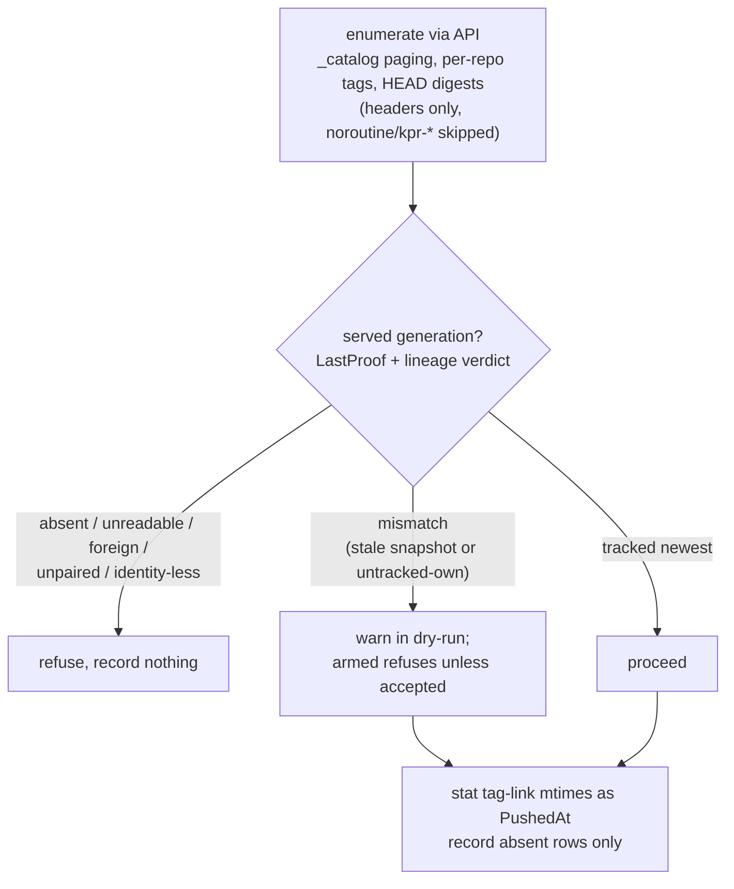

## Contents

- [Goal](#goal)
- [Success Criteria](#success-criteria)
- [Approach](#approach)
- [What backfills cleanly](#what-backfills-cleanly)
- [Addressed](#addressed)
- [What you don't need to worry about](#what-you-dont-need-to-worry-about)
- [Shadow reader (fallback)](#shadow-reader-fallback)
- [Steps](#steps)
- [Validation Plan](#validation-plan)
- [Risks / Open Questions](#risks--open-questions)

## Goal

`kpr store backfill`: adopt pre-kpr tags into tracked rows. Constraint: backfill reads tag-link mtimes off the shared mount (bytes, not names), so it gates per run on the served generation — `sentinel.LastProof` + lineage verdict, never a mint — and it honors the lock marker: locked refuses with the fix named. Stranger store refuses; a restored generation refuses armed unless `--accept-rollback` (a preview warns through), rows landing not-due. There is no API-only mode and no zero-time rows. Never clobbers receiver-known rows.

## Success Criteria

- Backfilled rows carry link-mtime push times and manifest digests, `actor=kpr-backfill`, not due; TTL/keep-N reason about them as real age.
- Locked refuses naming `kpr store unlock`; stranger store refuses; stale snapshot warns (dry-run previews, armed records only with `--accept-rollback`).
- Re-running over receiver-tracked rows changes nothing.
- `store backfill <repo-glob>` touches only matching repos; dry-run default with explicit `--no-dry-run` (decided).
- Backfill runs live on a writable registry; races resolve safe (re-push newer-wins, mid-run delete skipped by count).
- Enumeration authenticates with basic creds; rejected creds refuse the run loudly.
- Unit suite + lint clean, live compose-stack proof green (see Validation Plan), ARCHITECTURE.md documents the command.

## Approach

No stored gate anywhere: a resolved-and-persisted runtime config would let `serve` and `backfill` hold different opinions (different mounts, different times). Backfill gates on the served generation inline, per run — then acts on that run's verdict only.

Prerequisite: one prior mint (`kpr store unlock` or an armed `gc` — backfill itself never mints). Absent generation refuses naming that ceremony.

Unresolvable tags skip with a count (gone mid-run vs dangling is housekeeping's job, not backfill's). Existing rows keep receiver-stamped times — absence-only. No probe, no mint, no fs residue: pure reads, works live on a writable registry (re-push resolves newer-wins, delete resolves skip-by-count) and readonly with an empty row DB.

Key decisions:

1. **Prove per run, store nothing.** The gate is a local variable of the invocation, not config — no cross-process disagreement possible by construction.
2. **Unproven means refusal, never a guess** — mount present ≠ same store (the stale-DB3 lesson), and a guess would stamp false ages. No mount or failed proof ends the run before anything is recorded.
3. **No zero-time rows.** Every recorded row carries a proven mtime, so keep-N needs no zero-time skip — backfilled rows flow through all policies as real age.
4. **Backfill fills absence only** (enriching digest-less rows stays a follow-up).
5. **Dry-run by default** (`--no-dry-run` / `KPR_CLI_NO_DRY_RUN=true` to record), same arming as `reap`.
6. **Failures skip with counts**, same posture as catalog failures in `EvaluatePolicies`.

Alternatives rejected: a persisted runtime-config gate (stale opinions across processes — the reason for this revision); mtime without proof; backfilling due marks (marks need a policy or a human).

## What backfills cleanly

The cases backfill exists for — each ends tracked, with a digest, not due:

- **Ordinary pushed tags, stable volume, proof holds.** The everyday pre-kpr past: mtime reads true push time, HEAD resolves the digest, row lands with real age. TTL and keep-N reason about it correctly from the first reap.
- **Multi-arch index tags.** HEAD on an index tag returns the index digest; recorded like any other. The sweeper deletes indexes by digest the same way.
- **Detached signatures and attestations (`.sig`, `.att`).** Plain tags as far as enumeration goes — tracked with their own digests and ages.
- **A tag re-pushed mid-backfill.** Benign race: backfill may record the older digest, then the receiver's notification (newer push time) overwrites it. Newer wins by `Record` semantics; the summary counts may show one extra skip. No action needed.
- **Already-tracked tags.** Skipped silently by count — re-running backfill after an outage only fills the gap.

## Addressed

Cases that don't backfill but need no operator action — the design already answers them:

- **Tag deleted between list and HEAD.** 404 on resolve → skipped: it is gone, there is nothing to track, and a later push re-enters via the receiver. Churn on a live registry is expected and never silent — counted, not gated.
- **Catalog unreachable or gated.** Addressed by narrowing scope: backfill requires a reachable `_catalog` and a kpr user that can read everything, both validated up front — any gap refuses loudly by name instead of a silent empty run. What falls outside (blocked catalog, foreign auth) is the shadow reader's job, not backfill's.

## What you don't need to worry about

Cases that sound like backfill's problem but are owned elsewhere — no action, no special-casing:

- **Uploads in flight.** A half-pushed tag has no manifest yet, so enumeration can't see it — and shouldn't. The `partial` policy owns these; backfill and partial never overlap by construction.
- **Untagged manifests.** No tag points at them, so tag enumeration cannot see them, by definition. Only `gc` reclaims their bytes; backfill has nothing to do with them.
- **Space not coming back after cleanup.** Deleting tags and running `gc` soft-deletes; blobs dedupe re-pushes until Online GC (out of scope — needs a registry engine). Backfill neither causes nor cures this; it only fills in missing rows.
- **Manifest without a usable digest.** Missing or unparseable `Docker-Content-Digest` → skipped, untracked until re-pushed. Nothing to fix on the kpr side — the next push of that tag re-enters through the receiver with a real digest.
- **Dangling tag: still listed yet unresolvable.** Skipped with a count like any unresolvable tag. Detecting and marking those is `docs/GC.md` future work — nothing backfill needs to do about them.

## Shadow reader (fallback)

The gc image already COPYs the stock `registry` binary. That same binary can serve as a local read path: run a second copy against the same shared store and same redis DB, with `maintenance.readonly` on, loopback-only listener, and its own trivial auth — then point backfill's enumeration at it instead of the main registry.

What it buys: independence from the main registry's access policy. A blocked `_catalog` and auth-gated namespaces both disappear without touching main auth or handing kpr credentials. Reads are pure (catalog, tag lists, HEADs) against a live view; readonly mode makes mutation impossible; sharing the redis DB keeps blobdescriptor answers consistent.

Rules: loopback-only is non-negotiable — an unauthenticated registry must never be reachable off-host. Config is storage-identical to the main registry, auth replaced. One more mouth to feed (process, port, config drift), so it stays opt-in fallback, never default: our own stack should just let kpr reach the main `_catalog` internally.

## Steps

1. **Registry client: auth + `_catalog` paging + manifest HEAD.** The client speaks no auth today — wire basic (`KPR_REGISTRY_USER` / `KPR_REGISTRY_PASSWORD`, presented on every call) covering open and htpasswd registries. `CatalogAll` (Link pagination, follows rel=next until a page arrives without one, looping pages error), `ManifestDigest` (HEAD, digest + type headers, missing = skip). Rejected creds refuse loudly up front (a 401 on the first call ends the run, never a silent empty enumeration). Bearer-exchange against token issuers reuses the same pair later — future work, see `docs/GC.md`. `httptest` unit tests (basic accepted, 401 refuses).
2. **`kpr store backfill` command.** `runBackfill` reusing the root helper (`StoreRoot`, same one gc/unlock resolve) with the read gate (`sentinel.LastProof` + lineage verdict, no mint): enumerate → digest → served-generation gate → refusal cases refuse, mismatch warns in dry-run and refuses armed unless rollback-accepted → mtime → skip-tracked → print/record + `recorded/skipped/failed` summary. Cobra `store backfill [repo-glob]` with `--no-dry-run` plus `--accept-rollback` for the restored-generation risk (the one gate backfill accepts — same shape as gc's per-risk flags). Mem-store + stub-registry unit tests (absent records, tracked no-ops, mid-run 404 skips, ungated refusal, gated mtimes via `t.TempDir` store layout, unreachable-catalog refusal, rollback armed-refuses / accepted-warns / dry-run-warns).
3. **Per-repo scoping.** The positional glob filters enumerated repos before any tag work (unknown-repo typo → refusal, like exact names in `plan add`); unit test scoped vs full runs.
4. **E2E scenario.** Push tags, flush kpr rows, backfill armed (full + one scoped run), assert digests + times + none due; re-run asserts no-op.
5. **Docs.** ARCHITECTURE.md: backfill, per-run proof, mtime contract, storage-required constraint, scoping; Open item removed.

## Validation Plan

- New tests first, watched fail before impl (TDD).
- `go test ./... -count=1`, `make lint` (0 issues).
- Live on the compose stack instead of a testcontainers scenario:
  backfill needs the registry's store root on the caller's
  filesystem (shared mount), which the e2e fixture's internal
  registry volume doesn't expose — new harness for one checkbox
  is disproportionate. Proven instead: push → `store rm` (row
  dropped, tag kept) → `store backfill` re-records with link
  mtime, actor `kpr-backfill`, not due → `store inspect`
  confirms → `store rm --untag` cleans up.
- Manual: `docker exec kpr kpr store backfill` preview vs `--no-dry-run`; `kpr plan` empty; unmounted-store run refuses before recording.

## Risks / Open Questions

- **Risk: link mtimes need a trustworthy volume.** The tag-link mtime is exact when the registry wrote it and nothing rewrote history since. Trust it when:
  - *Stable volume, continuous operation* (bind mount or named volume, never restored or migrated): link files are created fresh by the registry process at push time — mtime IS the push time. This is the common case.
  - *Migrations and restores preserving times* (`cp -p`, rsync `-a`, filesystem snapshots): mtimes survive the move — true age reads through.
  - Do not trust it when:
  - *Reseeds and restores without preservation* (plain `cp`, volume re-seeded from object storage): mtimes reset to copy time — skew toward now, errs safe (extra life, never early expiry).
  - *Data copied into the volume from outside* (overlayfs copy-up of foreign files): carried copy time, skew toward now, errs safe. (Normal registry writes never copy up — they land directly.)
  - *NAS-backed storage with clock skew* (NFS server vs client clocks): shifts either direction; skew toward the past is the dangerous one (earlier eligibility).
  - The dangerous direction is skew toward the past (earlier expiry); skew toward now only grants extra life. No automatic correction: an operator who distrusts a volume's times re-pushes or `plan remove`s. Accepted — mtime stays an approximation, and backfilled rows land not-due either way.
- **Risk: `_catalog`/HEAD quirks across distributions.** Pagination Link-header flavors, catalog auth, registries answering HEAD with 405 — terminate on short/empty pages, treat missing digests and failed HEADs as skip-with-count, never fatal. A GET-with-body-discard fallback for HEAD-less registries is a possible follow-up, not v1. Covered in unit tests.
- **Risk:** store swap between proof and mtime reads mis-stamps push times — same exposure class as gc's mid-run flip, bounded to age skew on not-due rows; accepted, no post-proof (backfill deletes nothing).
- **Risk: keep-N is where backfill bites.** The other policies can't misfire on backfilled rows: `partial` needs digest-less rows (backfill records digests or skips the tag), `untagged` needs catalog absence plus grace, TTL skew only shifts eligibility of rows that land not-due for a human to review first. keep-N has one live edge: proven mtimes make old rows *legitimate* victims mixed with fresh rows (correct behavior, still surprising — review the plan, `--exclude` release lines).
- **Known limit: identity, not liveness.** The served-generation gate proves the mount *is* the registry's store, not that it is *current* — a stale snapshot serves an old generation too. For backfill that errs safe (missing newest tags fill in on the next run against a live mount); this reasoning must not transfer to gc, which deletes. No mint here by design: backfill deletes nothing, so freshness buys nothing — the write proof stays gc/unlock-only. Mismatch warns and proceeds (snapshot age, rows land not-due); a plain read failure refuses (no evidence — stranger's store or down registry). No `--init`, no one-time push: the first `gc`/`unlock` mint creates the generation backfill reads; enumeration skips `noroutine/kpr-*` — our sentinel/probe repos are machinery, never inventory.
- **Non-goals:** any persisted gate state, digest-less enrichment, backfill-then-sweep automation, API-only mode.
