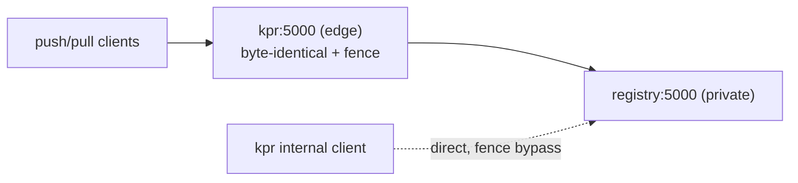

# Edge proxy

kpr in front of the registry: `serve` listens on `:5000` and
forwards pushes byte-identical to a private registry, fencing
mutating routes — HOLD leases around an armed collect, DENY on
the lock marker. The edge is part of `serve`, not a separate
command. `KPR_EDGE=false` opts out; a failed RelativeURLs proof
closes the edge loudly, never a boot refusal.

## Purpose

Two gc scars drove this. The collector demands the registry
stopped or readonly — and readonly isn't enough: a config kpr
trusts but can't enforce, manual flip-restart-flip-back
downtime, and the hot process keeps serving stale blob
descriptors after the collect (HEAD 200 for deleted blobs).
Second, that stale cache: gc deletes files but never
invalidates descriptors, and registry:3 offers no flush API.

The edge answers the first without demanding a readonly
registry: fencing at the proxy replaces the flip with
enforcement. The cache is handled by config, not ceremony —
full story in [`docs/GC.md`](GC.md), the deferred redis-alike
design in [`docs/BLOBCACHE.md`](BLOBCACHE.md).

## Shape

Compose-wise a port move: kpr takes the edge, the registry
loses its published port. `KPR_REGISTRY_URL` names the
backend; the frontend listener is the new bit. kpr's own
client goes direct — the fence governs everyone else's
traffic, never kpr's own calls.

The API layer, deliberately: a reverse proxy sees a manifest
PUT as one HTTP call with the reference set in the body — no
reconstruction, stall-the-PUT trivially implementable.
Proxying the storage or RESP layers would reason about
references from object keys or cache ops — fragile across
registry versions, corruption risk in the load-bearing path.
Rejected.

## Fencing

Two modes, both identity-blind (route+method, never
credentials; auth headers pass through opaque):

- **HOLD** — gc finalize: manifest PUTs wait on a bounded
  self-expiring lease (5m crash bound), fail-open. Sleepers
  re-read the lease file, so early release wakes promptly; a
  lease gc outruns flows unfenced but says `hold_expired`
  once, never silent. Blob uploads are never held — they
  reference nothing. A renewing heartbeat is the real answer
  past the bound; future work.
- **DENY** — store locked: manifest PUT/DELETE refuse fast
  while the marker is set (423 naming `store unlock`). Blob
  uploads and reads pass — uploads alone create no references
  (orphans are gc-reaped). The marker read is local per
  mutating request: no cache, no staleness, deliberately not
  redis. If the store ever goes s3-backed, the marker stays
  local or the proxy TTL-caches it with a stated leak window
  — decided then, not now.

### Port and drivers

`fence.Controller` (Hold/Deny/Allow) is the fencing port:
transitions, not truth. `kpr gc` armed collect drives Hold;
`store lock` / `unlock` drive Deny/Allow, voicing
`deny_engage` / `deny_release` at the transition — the ring
carries the flip with zero traffic. Enforcement stays
single-sourced (lock marker, lease file) through the same
evaluation the use cases mint from (a boolean here, not a
mint), so an announcement can never disagree with the gate.
`fence.Control` is the adapter (lease file + announcements);
`fence.Gate` enforces. The shared `Event`/`Reporter` vocabulary
lives in `event` — narrators import no use case.

### A noted exception

`fence` holds both the ports and the behavior acting on them —
impure by the book: behavior churn touches the agreement's
home, and `net/http` plus `proof` ride in every importer's cone.
Kept deliberately: one disputed agreement doesn't earn a ports
tree. If a second shows up, the ports move out and this note
dies.

### Proofs

`RelativeURLs` at open: the proxy takes the proof, no proof
no edge — an absolute backend `Location` is a fence bypass,
and bypass must not compile. Until config generation lands
the prover reads an operator-owned file (trust-but-verify).
`GatewayFencing` at the writable gc preflight: proven edge
listening, HOLD lease configured (`--accept-unfenced`
overrides). Model behind both in [`docs/PROOFS.md`](PROOFS.md).

### Console

The console carries the edge's live posture (open/closed,
deny/held) in its own section — a level reading of the
edge-triggered fence, plus the ring flips. Both transitions
are voiced at the moment they happen: `hold_engage` /
`hold_release` around the armed collect, `deny_engage` /
`deny_release` on lock/unlock — a quiet store still shows
what the fence did, push or no push.

### Location guard — fence-critical

Upstream `Location`s must be relative or edge-addressed; the
proxy asserts this per response (an absolute backend
`Location` routes writes around the fence). Three rules from
the distribution 3.1.1 `urlBuilder` research, in force:

1. `http.host` set → absolute URLs always: the bypass in pure
   form. Never set it at the backend.
2. `http.relativeurls: true` → bare route paths: proxy-proof,
   nothing to rewrite. The proof enforces this.
3. Default → absolute URLs from the request (`Forwarded` >
   `X-Forwarded-Host/Proto` > `r.Host`); behind a
   `ReverseProxy`, `r.Host` is the *backend* host unless
   preserved.

In-flight chunk URLs from before a DENY need no revocation —
they can't create references alone; the manifest PUT refusal
is sufficient.

## Ops

- `KPR_EDGE=false` opts out; other servers keep serving.
- HOLD needs the shared file backend (the lease is a file);
  anything else collects unfenced with the warning said out
  loud (`--accept-unfenced` owns that risk on armed runs).
- No per-identity fencing: internal vs external is told
  topologically (direct vs proxied). Per-identity belongs to
  a tenancy world, out of scope.

## Delivered

Slices 1–3, each proven live before the next — one list, the
history stays in git:

- Transparent byte-identical proxy + Location guard (large
  blobs incl. `Range`/resume, no audible overhead; absolute
  config refused at open).
- HOLD/DENY live: locked PUT→423 with remedy, uploads/reads
  pass, hold pins pushes to lease expiry, flips in the ring
  as `kpr-edge`, full cycle in-container (lock→423,
  unlock→forwarded); post-hold requests re-evaluate the
  marker (no blind forward).
- Online gc under the fence: preflight clears cache +
  gateway up front, `--accept-*` per risk, re-probe after
  the collect.
- Loud transitions: hold and deny flips voiced at the moment
  they happen (report stage + ring outcome), never only on
  push traffic.

## Elsewhere, not here

- A kpr-launched registry (supervisor mode, control events):
  [`docs/CHILD_REGISTRY.md`](CHILD_REGISTRY.md).
- Generated registry config and observed tracking: future
  efforts, unscoped.
