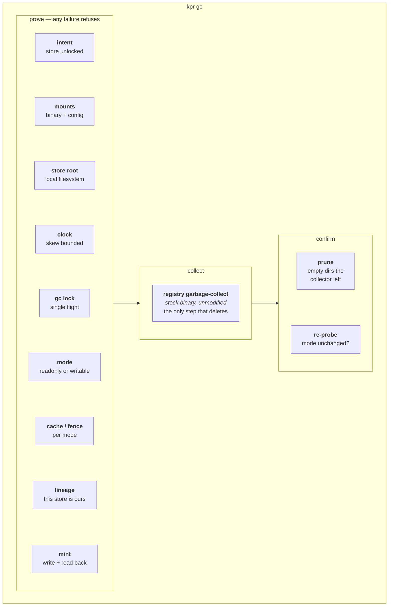

# Garbage collection

Manifest deletes drop references only; the bytes stay until
something collects them. kpr does not collect them itself.

`kpr gc` is a thin wrapper around the registry's own collector. It
shells the stock binary — COPYd from the same `registry:3` the
stack runs, unmodified — and everything kpr adds happens *around*
that call:

```bash
registry garbage-collect [--dry-run] [--delete-untagged] <config>
```

The wrapper exists because that binary will happily delete live
layers if the world is not what you assume: wrong store, vouching
cache, a push mid-collect, a clock that misorders generations. So
kpr proves the world first, collects, then confirms nothing moved
underneath.

## Contents

- [The shape of a run](#the-shape-of-a-run)
- [The gates](#the-gates)
- [Happy path](#happy-path)
- [What a collect covers](#what-a-collect-covers)
- [Stage events](#stage-events)
- [Accepted risks](#accepted-risks)
- [After an armed run: stale blob descriptors](#after-an-armed-run-stale-blob-descriptors)

Unbuilt gc designs live in [GC_FUTURE.md](GC_FUTURE.md)
(token-auth registries) and [GC_DANGLING.md](GC_DANGLING.md)
(dangling references).

## The shape of a run



Nine gates, one unmodified binary, two confirmations. The gates
run in the order drawn and the run stops at the first failure —
each refusal names its own remedy.

## The gates

Evidence is a value, not a boolean: each gate either produces a
sealed token or the run ends. A stage that needs one takes it as
an argument, so a path that skipped a gate cannot be written. The
kinds live in `internal/proof`, one file each; the model behind
them is [PROOFS.md](PROOFS.md).

| # | Gate | What it establishes | On failure |
| --- | --- | --- | --- |
| 1 | **Intent** | the operator opened this store | refuse — `kpr store unlock` |
| 2 | **Mounts** | the collector binary and registry config are both present | refuse |
| 3 | **Store root** | the config names a local filesystem root | refuse — gc is filesystem-only |
| 4 | **Clock** | mint timestamps are trustworthy, skew within 30s | refuse, or warn if the source is merely unreachable |
| 5 | **gc lock** | no other kpr-driven run is collecting | refuse — wait, or clear a stale `kpr:gc:lock` |
| 6 | **Mode** | the registry is classifiably readonly or writable | refuse — inconclusive is not a mode |
| 7 | **Cache / fence** | mode-specific, see below | refuse |
| 8 | **Lineage** | the store kpr sees belongs to the registry it serves | refuse — `kpr store adopt` |
| 9 | **Mint** | a fresh generation written to the mount reads back through the API | refuse |

Gate 7 inverts with the mode, which is the part worth internalising:

- **Readonly** (stopped or in maintenance) — no cache gate.
  The stock collector reads the same config and fails itself
  if a configured cache is unreachable; kpr takes no
  reachability probe of its own (the old dial is gone).
- **Writable** (serving) — there must be *no* descriptor cache at
  all, plus a proven gateway fence. A serving registry collects
  under a HOLD lease that pins pushes for the duration; a cache
  would keep vouching for blobs the collect just removed. The
  lease is bounded and self-expiring (5m crash bound),
  fail-open: pushes wait, sleepers re-read so early release
  wakes promptly, and a lease the collect outruns flows
  unfenced with one `hold_expired` — never silent. Engage
  and release are voiced (`hold_engage` / `hold_release`).
  Full fencing story in [EDGE.md](EDGE.md).

The mode decides the path. There is no `--online` flag to forget.

Gates 1–5 run before the mode is known, so they apply identically
either way. Gate 9 is skipped by previews — a preview reads the
served generation to confirm one exists, but never writes, because
only a fresh mint can tell a shared store from a stale snapshot,
and only an armed run needs that distinction.

## Happy path

Previewing is the default and is always safe:

```console
$ kpr gc
gc online preflight (registry serving — armed collect runs under the fence):
  [ok] blob cache: none configured (deletes reclaim immediately)
  [ok] gateway: proven edge on :5000 (HOLD will pin pushes)
Warning: registry is writable; dry-run mode, nothing will be deleted
... collector output, streamed line by line ...
dry-run complete: nothing was deleted (collect for real with --no-dry-run)
```

Arming it adds the mint, the fence, and the prune:

```console
$ kpr gc --no-dry-run
gc online preflight (registry serving — armed collect runs under the fence):
  [ok] blob cache: none configured (deletes reclaim immediately)
  [ok] gateway: proven edge on :5000 (HOLD will pin pushes)
shared store proven via noroutine/kpr-sentinel:latest generation 0193...
Warning: registry is writable; collecting under the cleared online preflight
... collector output, streamed line by line ...
removed 2 husk repos (a, nest/b)
pruned 48 empty directories
```

A stopped or readonly registry prints no preflight — it takes the
classic offline path, where the only mode-specific demand is that
the descriptor cache answers.

Two things the output is telling you:

- **`shared store proven via …`** is gate 9 having completed. If
  you armed a run and this line is absent, nothing collected.
- **`pruned N empty directories`** is kpr's own cleanup, not the
  collector's. The stock binary removes blobs and links but leaves
  their parent directories, so every run would otherwise grow an
  empty tree.
- **`removed N husk repos (…)`** is the same idea one level up:
  tagless repo dirs (swept bare, collected, never tagged) go
  whole, sentinel-prefix repos never. A fresh upload session
  vetoes (a push may still be tagging); crash residue older
  than a day never does. Orphaned blobs go with the next
  collect.

## What a collect covers

The stock collector marks **globally** — every repository in the
store, every run. A collect cannot be scoped to one repository;
that is a stock limitation kpr inherits, not a kpr choice
([GC_FUTURE](GC_FUTURE.md#per-repo-collection)).

`--delete-untagged` is the registry's own flag, passed straight
through. It widens the sweep to manifests no tag points at.
Without it, an untagged manifest keeps its blobs alive.

kpr's own proof repo needs no special handling. Sentinel
generations are bounded by keep-N and removed through the ordinary
reap-and-sweep path, so a default collect reclaims their blobs and
`--delete-untagged` is never required on their account — see
[SENTINELS.md](SENTINELS.md).

## Stage events

Alongside the human-readable output, a run emits structured stage
events carrying elapsed time, and a pid or error where relevant.
The vocabulary is fixed and shared with the sweeper's reporting
shape, so a console could subscribe without anything new.

| Stage | Emitted when |
| --- | --- |
| `pre_probe` | the mode classification lands |
| `start` | the collector lifecycle opens |
| `spawn` | the subprocess is forked |
| `started` | it reported its pid |
| `collect_begin` | output streaming begins |
| `collect_exit` | the subprocess exits |
| `stopped` | the run was cancelled and the subprocess killed |
| `prune` | empty-dir cleanup finishes, with the count or the error |
| `husk` | tagless-repo removal finishes, with the count or the error |
| `post_probe` | the mode is re-read after collecting |
| `mode_flip` | the re-read disagrees with the pre-run mode |
| `failure` | the run failed, carrying the collector's last line |

## Accepted risks

Five things can be waived, each with its own flag. There is no
umbrella: every flag names exactly one risk, and all of them are
inert unless the run is also armed — accepting a risk on a preview
is meaningless, so the token is never produced.

| Flag | Waives | What you are accepting |
| --- | --- | --- |
| `--accept-clock-skew` | gate 4 | Mint timestamps may misorder, so generation comparison can lie about which is newer. |
| `--accept-blob-cache` | gate 7, writable | The descriptor cache keeps vouching for deleted blobs until it drops, so a re-push can re-create a dead tag. |
| `--accept-unfenced` | gate 7, writable | No HOLD lease pins pushes, so a push landing mid-collect can be corrupted by it. |
| `--accept-rollback` | gate 8 | The served generation is older than what kpr tracks. A restore may have resurrected blobs the tracked state thinks are gone. |
| `--accept-mode-flip` | post-probe | The registry changed mode mid-run, so writes may have raced the mark phase. Verify pulls before trusting the result. |

The first four are refused *before* anything is deleted. The last
one is different: by the time a flip is detected, the collect has
already happened — the flag decides whether the run reports success
or failure, not whether it proceeds.

Two refusals carry no flag at all, by design:

- **A foreign store.** No acceptance overrides lineage against
  another registry's identity; the remedy is the explicit
  `kpr store adopt` ceremony.
- **A locked store.** `kpr store unlock` is the remedy, and it
  proves the store before setting the marker.

## After an armed run: stale blob descriptors

The collector deletes blob files but never invalidates the
blobdescriptor cache — registry:3 exposes no flush API for it
(HTTP surface is the v2 API plus debug/health only). Until the
cache drops, the registry vouches for deleted blobs: HEAD answers
200, so push clients skip the upload (`existing blob`), manifest
PUTs 201 against surviving revision links, the tag PUT 201s — and
the tag is broken (`MANIFEST_UNKNOWN`, content absent from
`_blobs`). Observed end to end: blob HEAD 200 with no link and no
data file on disk, flipping to 404 after a registry restart, at
which point a re-push uploaded everything for real (0 skipped)
and the tag resolved.

Remedy — restart alone is not always enough:

- **File stack** (`registry-config.file.yml`): no descriptor
  cache at all (deleted section — proven: blob HEAD 404s the
  moment gc finishes, re-push uploads for real). Nothing to
  restart, nothing to flush.
- **Cached deployments** (inmemory or redis): a gc against a
  *stopped* registry gets a fresh inmemory cache free; a gc
  against a *readonly-but-running* registry needs an explicit
  restart, otherwise the hot cache keeps vouching for deleted
  blobs. Restart does *not* drop redis keys — flush the
  descriptor DB too (`redis-cli -n 3 FLUSHDB`; DB 4 holds kpr
  rows and is untouched). Descriptors are pure cache,
  repopulated on demand.

Dry-run previews delete nothing, so the cache stays valid — no
remedy needed there.

kpr does not restart the registry itself — the collector's proof
ends at the store boundary. A re-push between gc and restart
re-creates a dead tag; a restart plus a fresh push self-heals.
