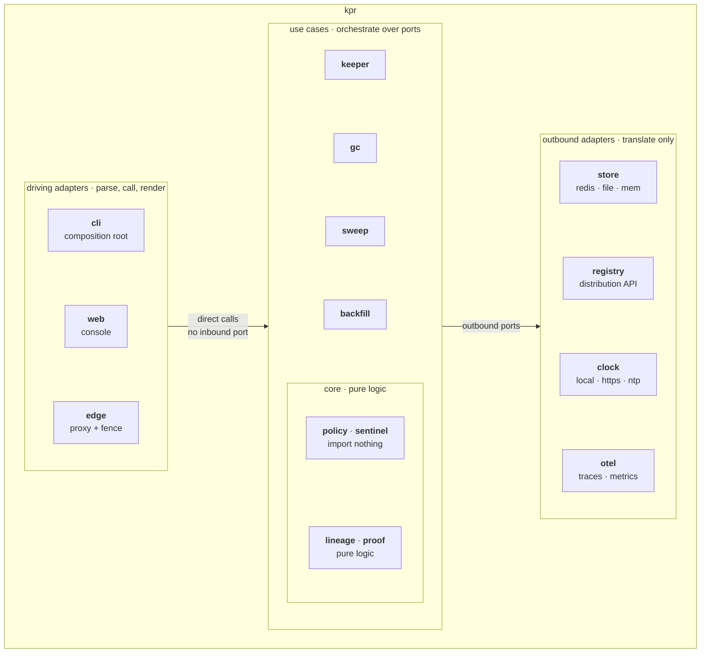

# Hexagonal architecture

kpr is hexagonal: a `policy` core, `keeper`/`gc`/`sweep`/`backfill`
use cases, `store`/`registry`/`clock` outbound adapters, and
`cli`/`web`/`edge` driving adapters.

This page is the port map as it stands. One rule governs additions:
**a new port must remove a fake, a duplication, or a scattered
wiring block, or it doesn't get cut.**

Two companion pages carry the reasoning, so this one doesn't have
to:

- [HEXAGONAL_STUDY.md](HEXAGONAL_STUDY.md) — the worked
  post-mortem that produced the current enforcement design.
- [HEXAGONAL_WISDOMS.md](HEXAGONAL_WISDOMS.md) — the
  port-cutting rules, distilled.

## Contents

- [Where we are](#where-we-are)
- [Shape](#shape)
- [Standing rules](#standing-rules)
- [Settled questions](#settled-questions)
- [How hexagonal is it](#how-hexagonal-is-it)

## Where we are

The foundation, still true:

- `policy` is the core. `Row` + `Select*` are pure over
  `(rows, catalogs, now)`. `store` and `sweep` import `policy`,
  so dependencies point inward.
- `store.Store` is a proper outbound port. `RedisStore` +
  `MemStore` + `FileStore` behind it, `storetest/contract.go`
  pins all three to one contract.
- `clock.Source` is the one port the core-adjacent code grew
  after the foundation: `local` (trust the machine, default),
  `https` (a `Date` read), `ntp` (SNTP over UDP) — three
  implementations differing in a way someone uses, which is
  exactly the rule below. Mint timestamps arrive checked;
  future JWT checks reuse the exposed offset. Full approach in
  `docs/TIMESTAMPS.md`.

Closed leaks (receipts in `docs/HEXAGONAL_WISDOMS.md`):

1. `registry` had no port — now `sweep.Registry`,
   `keeper.CatalogSource`, `keeper.Prober`.
2. Use cases lived inside driving adapters — now `keeper`;
   `web` formats, `cli` prints.
3. `Store` is four ports in one — kept fat deliberately (one
   package of callers per cluster, single implementation;
   narrowing would be ceremony).
4. `gc` hid in `cli` — extracted behind
   `Probe`/`Collector`/`Locker`.
5. Wiring scattered across every cobra `RunE` — collapsed
   onto `cli.openDeps`.

Inbound bypass (stays): the mark is the interface. The redis
hash is a public inbound surface that bypasses use cases by
design; the sweeper TTL floor (never wipe before promise
elapses) guards it, and `storetest/contract.go` pins the key
layout.

## Shape

Four bands. Dependencies point inward: adapters know the use
cases, the use cases know the core, the core knows nothing.

Humans drive `cli`, pushes drive `edge`, and the registry drives
the `/events` receiver in `app`.

The two arrows are deliberately asymmetric. Only the right one
names ports, because only the driven half has any — the driving
adapters call use cases as plain functions. That missing half is
the honest state of the hexagon, not a gap in the drawing: see
[How hexagonal is it](#how-hexagonal-is-it).

The one arrow the picture leaves out is the published bypass:
anything that can write a due mark reaches `store` directly,
around every use case — see [Where we are](#where-we-are).

Every package, and what it may import:

| Band | Packages | Imports from `internal/` |
| --- | --- | --- |
| Core (leaves) | `policy`, `sentinel` | nothing |
| Core (pure logic) | `lineage`, `proof` | each other, `policy`, `sentinel`, plus adapter packages for types |
| Use cases | `keeper`, `gc`, `sweep`, `backfill` | core + adapter packages for types |
| Driving adapters | `cli`, `web`, `edge` | anything — `cli` is the composition root |
| Outbound adapters | `store`, `registry`, `clock`, `otel` | `policy` only (`store`); the rest import nothing |
| Shared wiring | `app`, `config` | `config` → `clock`; `app` → `config`, `otel`, `policy`, `store` |

Two readings worth keeping:

- `sentinel` is a pure leaf. The store layout and payload schema are
  domain logic, not adapter code — it compiles with no dependency on
  redis, HTTP, or the filesystem.
- `lineage` and `proof` hold pure logic but name `store` and `clock`
  types in their signatures. Those are the wrong-way arrows admitted
  in [How hexagonal is it](#how-hexagonal-is-it); they close with a
  second differing implementation or not at all.

## Standing rules

- One slice at a time, TDD, pipeline green, coverage honest
  (the gate is the unit+e2e union; unit-only gaps need
  naming, not hiding).
- No gRPC/IDL, no framework.
- `keeper` naming: `keeper` (repo vocabulary), not
  `usecase`/`service`.
- New ports stay gated: each needs a "does it pay?" verdict,
  not auto-approval. Measure: lines deleted, fakes deleted,
  duplicated strings gone.

## Settled questions

- `sweep` stays a use case package itself: it keeps the pass
  loop and consumes the `Registry` port, no move under
  `keeper/`.
- Per-consumer store interfaces declined: `Store` stays the
  implementation, clustering documented per-method.
- `gc` ports landed as three tiny interfaces in the `gc`
  package (`Probe`/`Collector`/`Locker`), adapters in `cli`.
- `Clock` correctly dropped — then correctly re-cut as
  `clock.Source` when the second and third transports
  arrived with real behavioral differences (managed-time
  hosts vs sandboxed egress vs precise NTP). A port needs a
  second implementation that differs in a way someone uses;
  time-as-an-argument still covers the pure core.

## How hexagonal is it

**Driven side: fully.** Every outbound effect in the use cases
goes through a substitutable port (`sweep.Registry`,
`keeper.CatalogSource`/`Prober`, `gc.Probe`/`Collector`/`Locker`,
`clock.Source`, `store.Store` under a contract all adapters honor),
and unit tests prove it — no HTTP server, no binary, no redis,
no network needed.

**Driving side: no ports at all.** `cli`, `web` and `edge` call
`gc.Run`, `backfill.Run`, `keeper.EvaluatePolicies` and friends as
plain functions; there is no inbound interface between them. This
is the unfinished half of the hexagon, and it stays that way on
purpose — one driver per use case means an inbound port would have
exactly one implementation, which fails the rule above. It earns
itself when a second driver with a different failure policy
arrives, i.e. the detached API. The one exception already exists
and is published rather than cut: the due-mark bypass below.

Package-graph purists would find three arrows pointing the "wrong"
way: use-case signatures still name adapter packages for types —
`store.Store` + `store.GCLockKey` in `keeper`/`gc`, `registry.Outcome*`
in `sweep`. Those close with a second *differing* implementation
or not at all (a port needs a second implementation
that differs in a way someone uses). Until then, narrowing them
is ceremony with zero substitution payoff.

Deliberate non-textbook bits: the composition root is
`cli.openDeps`, not `cmd/app` injection (restructuring
every cobra var buys nothing); the redis due-mark is a public
inbound surface bypassing use cases by design (guarded by the
sweeper TTL floor).

Accepted review findings, recorded so they stay decided:

- `gc.Run` writes warnings to its `io.Writer` instead of emitting
  events — the one place "core returns data" isn't met. Accepted
  and deferred: warning event types + `renderGCEvent` land with
  the second consumer of gc output, or the next gc touch,
  whichever comes first.
- The three wrong-way type arrows (`store.Store` in `keeper`/`gc`,
  `registry.Outcome*` in `sweep`) stay until a second differing
  implementation asks.
- Sweep-only `Delete` stays convention-held (plus TTL floor and
  contract tests), not interface-held — sense over rulebook at
  this size.
