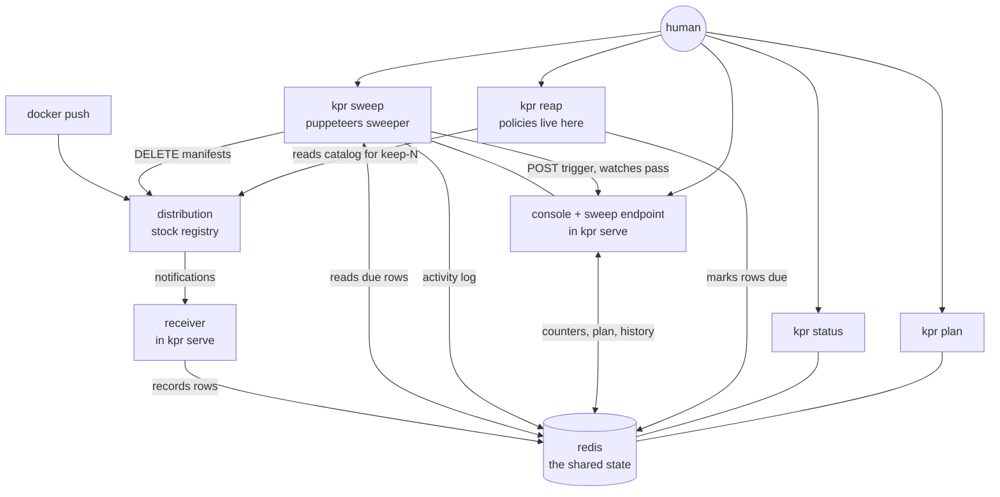
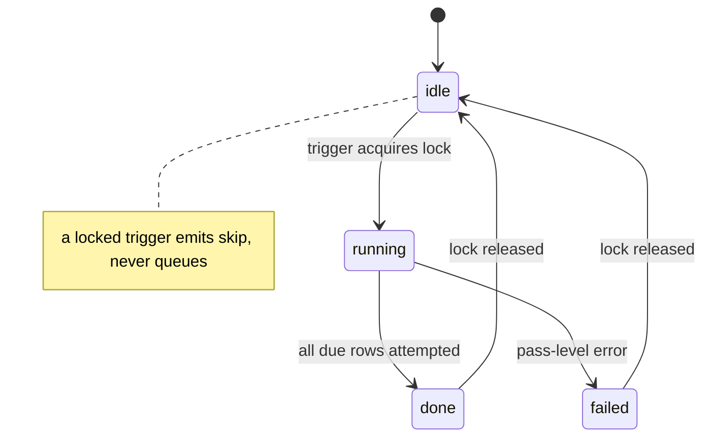

# kpr plan

Dead-simple companion that keeps a local `distribution` registry from
becoming a pig. One binary, one redis, opinionated behaviors written as
plain code — no policy engine.

Placement rule: the behaviors are client-side — they live in the
`reap` command (or any script), not in `serve`. `serve` is a dumb
executor: the receiver records rows, the sweeper deletes due rows.
Marking a row due with a sweep reason **is** the interface: `reap`
holds the programmatic policies, but anything that can write the mark
(a shell script, a cron job, a human with redis-cli) decides how and
when to clean what. Tunings live next to the policy code
(package-level consts at the top of the policy file), **not** in the
main config — `internal/config` stays wiring-only (ports, redis addr,
registry URL).

## Architecture

Sweeping has one owner: the sweeper in `serve`, the only writer that
deletes from the registry. The CLI splits along the decision line:
`reap` marks, `sweep` puppeteers. `reap` evaluates the policies
(reading candidates from redis, and the catalog from the registry for
keep-N) and marks rows due with a reason (`ttl:10m elapsed`,
`partial:older than 24h`, `keep-n:exceeds 10`) — analysis-heavy, fast,
no registry writes. `sweep` POSTs the sweep endpoint and watches the
event dance to the pass summary — no opinions, just triggering and
reporting. Marked rows are picked up on the next tick even if no one
ever runs `sweep`, so the trigger is an accelerator, not a
dependency. `status`/`plan` stay pure redis reads. No gRPC, no IDL —
one small HTTP trigger on the server that already exists.

## Failure modes

- **Redis down**: receiver can't record (logs, banner goes red;
  pushes in the gap stay untracked — accepted and visible, not
  silent). Sweeper skips ticks it can't read. CLI fails fast with a
  clear error. Nothing half-happens: every mutation is row-gated.
- **Registry 500s on delete**: the row stays, the attempt is logged
  to activity, retry happens next tick. `sweep`'s watch surfaces the
  failure instead of swallowing it.
- **Sweep endpoint unreachable**: `sweep` reports "N rows due, sweeper
  not reached — next tick picks them up." Degrades to the tick loop,
  which was always the backstop.

## Sweeper events

A sweep pass is a long, multi-stage operation — modeled on a fixed
stage vocabulary with one event struct, emitted in-process and (later)
on the wire. Silence stays cheap: events are small JSON, written to
redis run-state, never fail the pass.

| Stage | Meaning |
| --- | --- |
| `start` | pass entered (trigger: tick, startup, or POST) |
| `skip` | nothing due, or another pass holds the lock |
| `row` | one due row attempted (repo, tag, reason, outcome) |
| `done` | rows exhausted (performed / planned / failed counts) |
| `failure` | pass-level error, e.g. redis lost mid-pass |

Run state lives in redis under two keys: `current` (one JSON record,
overwritten through the pass: pass id, stage, started_at, trigger,
due/done counts) and the capped outcome `activity` ring. That is what
lets a CLI report "what the sweeper is doing right now" without
anyone streaming logs.

Transport for live stages is undecided (redis polling of `current`
vs. a websocket on the console) — deliberately deferred. The
vocabulary and the keys are the contract; the wire comes later.

Anti-scheduler guardrails, so the event flow doesn't grow a task
manager:

- Single-flight via a redis lock with expiry (a crashed sweeper
  can't hold it forever). A trigger that finds the lock emits `skip`.
- Triggers are exactly three: tick, sweep-on-start, POST. No queue,
  no backlog, no cron inside the server — a second trigger never
  stacks work, it skips.
- Events describe one pass at a time. There is no job record, no
  history beyond the capped ring, nothing to retry except the next
  tick picking up rows that are still due.

## Feedback, not log streaming

Redis holds state, never log streams. Two feedback paths, both
bounded:

- **Pass summary**: the sweep endpoint's HTTP response carries the
  outcome of the triggered pass (performed / planned / failed counts
  plus failures). That is `sweep`'s feedback — synchronous, no redis
  polling.
- **Activity**: a capped ring in redis (last ~100 small outcome
  records: repo, tag, reason, outcome, timestamp) backing the
  console's Activity section. A ring of outcomes is state — it
  answers "what happened" at a glance. Verbose operational logs stay
  where they are (stdout / OTLP), never in redis, never pushed to
  clients.

## Surfaces

Console (server-rendered, no SPA) shows only what kpr tracks — never
a registry catalog:

- **Banner**: registry reachable / redis reachable / sweeper armed vs
  dry-run.
- **Counters**: rows tracked, deletes performed/planned, per behavior.
- **Plan**: what the next sweep would delete, with reasons.
- **Activity**: the capped outcome ring, with reasons attached.

CLI, next to `serve` and `env`:

- `kpr status` — banner + counters as text, for scripts and ssh.
- `kpr plan` — pending candidates, optionally JSON for piping.
- `kpr reap` — evaluates the policies and marks rows due with
  reasons. Dry-run unless `--no-dry-run`: unarmed, it only prints the
  plan (same source as `kpr plan`).
- `kpr sweep` — triggers a sweep pass and watches it to the summary.
  No opinions, no marks, no dry-run flag: it only processes rows
  already marked due. Safety lives in `reap`'s marking and the
  sweeper's expiry floor, not here.

Colocation constraint: the CLI talks to redis directly, so it runs in
the same environment as `serve` (same network, same redis auth). An
API head for detached `reap`/`sweep` is tempting and explicitly
deferred — once the colocated loop is comfortable, remote operation
can ride the console's HTTP surface (it already serves the same
data). No second transport until then.

## Milestones

### M1 — housekeeping (partial uploads, dead weight)

`serve` learns to record and to sweep due rows; the opinions live in
`reap` as code with colocated tunings:

- **Stale upload sessions**: blob uploads that never completed
  (tuning: max age, `24h`). Interrupted pushes are the most common
  pig feed.
- **Untagged manifests past grace** (tuning: grace period, `168h`):
  tags deleted upstream leave manifests behind; after the grace
  period kpr deletes them via the API. Blob bytes still fall to the
  registry's own GC pass.
- **keep-last-N per repo** (tuning: N, include/exclude regexps):
  long-lived repos keep their N freshest tags, the rest are
  candidates. Written as a straightforward function, not a rule
  language.
- Dry-run is implicit: every intended delete is logged and nothing
  changes unless explicitly armed with `--no-dry-run`. The console
  lists pending and completed deletions with the reason attached
  (which behavior, which tuning value).

Done when: push-interrupt storm leaves nothing older than the
tuned age, dry-run shows the plan first, every real delete is
explained in the console — and the admin surface (list candidates,
approve, delete) is usable enough that a future CLI could drive it
instead of a human clicking.

### M2 — ephemeral tags, ttl.sh-style mechanism, kpr semantics

Same path, one new policy in `reap` marking rows due. Deliberate
departure from ttl.sh: the tag is a **minimal promise**, not a
deadline. `app:10m` is guaranteed to exist for 10 minutes after push
(never wiped before), and becomes eligible for collection any time
after. Expiry is a GC signal; the actual wipe happens whenever
`reap` runs — on demand, on cron, manually. No tick-chasing exact
deadlines.

- Tags matching `^\d+(s|m|h|d|w)$` become eligible that long after
  push. Eligibility anchors at the receiver-stamped push time, not at
  mark time — a late `reap` run must not grant extra life.
  Non-matching tags fall back to a default (empty = no expiry).
  Everything clamps to a max. Default and max are tunings next to
  the parsing code, not main-config entries.
- Row removed only after the registry confirms the delete; failures
  retry next tick; already-gone counts as success.
- Manifests held by an index are untracked, not retried forever.

Done when: `app:10m` pushed to a scratch repo still pulls at minute
9, is marked by `reap` and gone after `sweep` past minute 10 (or the
next tick without any CLI), shows in the console with its reason —
and a normal `:latest` is untouched with the default empty.

## Deliberately out

Policy/workflow engine, task manager, scheduler, config-file or
DB-backed rules, per-repo rule sets, auth, signing, replication,
cloud integrations. keep-last-N and include/exclude regexps stay —
as plain functions with colocated tunings, not as a rule language.
If a behavior starts wanting its own engine, it moves out to the
admin CLI instead of growing inside kpr.

## Background: ttl.sh and zot

What the two projects do today, and what kpr takes from each. Sources:
upstream `replicatedhq/ttl.sh` main branch and `project-zot` docs, read September 2026.

### 1. ttl.sh

Then (a year ago): plain `distribution` registry, a couple of notification
hooks, redis for expiry bookkeeping. That version is gone.

Now: the registry was swapped to **zot**, and the companion is a real Go
service, `sidecar/zot-ephemeral-ttl`. Its mechanism, piece by piece:

- **Ingest** — zot's events extension pushes CloudEvents
  (`zotregistry.image.updated`, binary or structured mode) to the sidecar.
  No polling.
- **TTL parsing** (`internal/ttl`) — expiry is encoded in the tag:
  `^\d+(s|m|h|d|w)$`. Non-matching tags get a default TTL, everything is
  clamped to a max, and integer overflow saturates instead of wrapping
  (a wrapped-negative duration would expire immediately — the opposite of
  a huge TTL's intent).
- **Store** (`internal/store`) — redis with exactly two keys: a HASH of
  `(repo, tag, digest, expires_at)` rows and a ZSET expiry index, members
  joined with a NUL separator, written transactionally. Rows carry **no
  redis key TTL**: the reaper must see an expired row to issue the delete,
  and removes the row only after the registry confirms.
- **Reaper** (`internal/reaper`) — sweep loop with a sweep-on-start (a
  restart doesn't wait a full interval). Failed deletes retry next tick.
  Already-gone (`NAME_UNKNOWN`/`MANIFEST_UNKNOWN`) counts as success.
  Manifests held by an index (`405 DENIED`, despite the wording) are
  untracked rather than retried forever — zot's untagged retention
  collects the child.
- **Registry client** (`internal/registry`) — `DELETE /v2/<repo>/manifests/<tag>`
  against the OCI API, bounded contexts, body-matched error codes so a
  genuinely malformed request stays retryable and visible.
- Every package has tests, plus golangci config and a Makefile.
- Timing semantics: expiry anchors at event receipt
  (`expires_at = event_time + TTL`), the reaper ticks every 30s, so a
  `1h` tag lives its hour plus up to half a minute of tick slack. kpr
  departs here: the tag is a minimal promise (never wiped before),
  expiry is a GC signal collected whenever `reap` runs.

Complexity added since the simple version: CloudEvents parsing in two
modes, multi-arch index reference handling, cosign `.sig` tags outliving
their image, interplay with zot's own untagged retention. None of it is
gratuitous — it is the edge-case load of running the trick in production
as a public service. Around the core sits hosted-service scaffolding kpr
doesn't need: Ansible/Hetzner deploys, nginx tuning, a Next.js site,
zot metadb experiments (later removed), GC time windows.

### 2. zot

An OCI-native registry (CNCF Sandbox) with the lifecycle features
`distribution` lacks, built in:

- **Retention policies** in config: per-repo globs, keep N
  most-recently-pushed/pulled, pushed/pulled-within windows, regex
  patterns, `deleteUntagged` with activity-based `keepUntagged`,
  `deleteReferrers`, `dryRun`, grace `delay`. Defaults already delete
  untagged manifests; tags are retained unless a policy says otherwise.
- **Online GC** in a daily UTC window, Prometheus metrics, scrub,
  search/UI, sync — extensions in the same binary (with a `zot-minimal`
  build that strips them).
- Proper OCI semantics: artifacts, referrers, cosign flows.

Sharp edges: defining one `keepTags` rule removes everything not
matching (their docs insist on a catch-all default policy); untagged
deletion is default-on; retention evaluation has subtle behaviors around
digest statistics. And the structural gap: retention is
activity/count/window-based — there is **no tag-encoded TTL**. Even on
zot, per-tag expiry-by-name needs the sidecar.

### 3. Fit assessment

Neither is a fit for "dead simple but maintainable local registry that
doesn't become a pig":

- ttl.sh is a **hosted service codebase**. The absorbable part is the
  sidecar's mechanism (event → redis row → sweep → confirmed delete),
  not the Ansible/nginx/Next.js shell around it.
- zot is a **registry replacement with a policy engine**. Adopting it
  trades distribution's missing features for a config surface of
  retention policies, extensions, and GC windows — exactly the bloat
  the project wants to avoid. Its CloudEvents/metrics/scrub shape is
  useful reference, not a dependency to take.

kpr's position: stay a dumb-registry companion. Speak the plain
distribution API (keeps zot working as a backend for free), keep all
policy in testable Go with colocated tunings, absorb ttl.sh's sidecar
semantics minus the hosted-service load.

## Status (MVP, September 2026)

Built on `master`, CI green, full suite + lint clean, coverage ~91%,
proven live in compose: push → receiver tracks → `reap --no-dry-run`
marks (one policy via `reap <name>`, or hand-picked via `plan add` /
`reap add`, pruned via `plan remove`) → `sweep` deletes by digest →
`make gc` reclaims disk (48M → 1.1M on the test repo; `kpr gc`
previews by default, `--no-dry-run` collects).

### M1 — housekeeping: mostly wired, one gap

- **Stale uploads** (`partial:older than 24h`): selector implemented,
  tested, evaluated by `reap`. Caveat: the receiver records manifests,
  which always carry digests — so digest-less rows barely occur
  outside backfill. The behavior exists; the residue it hunts mostly
  doesn't, yet.
- **Untagged past grace** (`untagged:past grace 168h`): implemented,
  tested (including absent-catalog skip), evaluated by `reap` against
  live catalog reads.
- **keep-N** (`keep-n:exceeds 10`): this is the gap. The selector is
  implemented and tested (boundaries, include/exclude filters,
  catalog-only tags default keep) and `reap` does evaluate it — but
  with a hardcoded N=10 and nil include/exclude. No flag, no
  per-repo tuning, no way to protect a release line outside code.
  Tested, running, but not a usable policy surface: the first thing
  to finish if keep-N is meant to be real.
- **Implicit dry-run**: done at both layers — `reap` prints unless
  `--no-dry-run`, the sweeper plans unless armed.

### M2 — ephemeral tags: done

TTL parse/clamp/eligibility (overflow saturates, unknown age defaults
keep), receiver-stamped push time, sweeper expiry floor regardless of
mark, confirmed deletes by digest with tag fallback. Done-criteria
met live: `:10s` tags pull fresh, marked past promise, gone after
`sweep`; `:latest` untouched.

### Beyond the milestones

Single-owner sweeper (redis lock, 5m bound; a kill mid-pass pauses
sweeping until expiry — observed live), delete-by-digest (tag
deletes 405 on distribution:3), server-rendered console, colocated
`status`/`plan`/`reap`/`sweep` CLI, OTel overlay (Quickwit + Jaeger
+ Prometheus + Grafana) with `sweep pass`/`sweep row` activity
records indexed in Quickwit, `make gc` for the offline blob
reclaim (`--delete-untagged`, registry downtime accepted): sentinel
readiness probe plus same-store proof, shared `kpr:gc:lock` with
30m bound, post-run re-probe that fails on a mode flip. The lock is
advisory by necessity — distribution's `MarkAndSweep` (audited at
v3.1.2) sets no lock and mark-then-sweep races a concurrent
collector, so never run a manual `garbage-collect` alongside.

### Open, in no order

- Finish keep-N as a policy surface (N still fixed at 10; `--exclude` shipped).
- Backfill for pre-kpr tags; unknown-age rows default keep today.
- Real partial-upload detection (bounded manifest reads).
- Detached `reap`/`sweep` over the console HTTP surface.
- Sweep live-stages transport (polling vs websocket) — still
  deferred; the vocabulary and keys are the contract.
- Online GC — a much-later registry conversation; soft-deleted blobs
  dedupe re-pushes until then.
- Registry metrics as a GC-readiness signal (storage pressure before
  collecting) — noted, not scheduled.
- Tag-release flow (image push + Forgejo release) unverified.
